# KONTZE / KONZE / CONTZEN FAMILY TREE

## Reconstructed from Archion Register 220096, Ancestry, FamilySearch, and Peter Schrader's Research

*Compiled: April 1, 2026 | Updated: April 26, 2026 — Jed Johnson + research sessions 11–74*

*Purpose: Map the Kontze/Konze/Contzen families of Trendelburg and Deisel to connect Charles Johnson Sr. (b. 26 January 1835, Deisel/Trendelburg area; d. 16 December 1903, St. Louis, Missouri) — identity confirmed FamilySearch PID LZXC-6GB — to his German birth record. American surname "Konzen/Konze/Kontze" may be a Hausname rather than official church surname. **CURRENT STATUS: there is NO active candidate for Charles's German birth record.** Entry 195 — once the leading candidate — is **ELIMINATED** (see banner below).*

> 🛑 **ENTRY 195 IS ELIMINATED — DO NOT RE-OPEN AS A CANDIDATE.**
> **Settled by Peter Schräder (expert paleographic reader), retraction dated 4 May 2026** (documented in `correspondence/HStAM_Marburg_Stammrolle_Anfrage_May2026.md`). Entry 195 (KB 218842, image 40, Deisel Gänsewinkel, born 20 Jan 1835) is **the record of a male Köster infant who died unbaptized at/near birth** — NOT Charles. The child-name column reads only **"Männl: Köster"** (sex + surname, no given name) with the **‡/"ungetauft" marker and an empty godparent column**, which is the standard register convention for a newborn who died without proper baptism. The earlier "Justus" reading was a misread of this entry and is void.
>
> **Why it kept resurfacing — and the inference error to retire:** older drafts (this file's pre-26-April text, the diagram/ASCII tree below, and parts of the website) reasoned "no burial found in register 218851 → emigration → strongest candidate." That is a **false inference**: an infant who died unbaptized in January 1835 is recorded in the *baptism* register's notation, not necessarily in the regular burials register, so "no separate burial" does NOT mean the child survived. Peter Schräder's direct read of the entry settles it. Any text below or elsewhere still calling Entry 195 a "candidate," "strongest candidate," or "emigration evidence" is **stale and superseded by this banner.**
>
> *Correction history: a 4 June 2026 verification pass initially (and wrongly) treated the missing given name as merely "illegible (Nottaufe)" and kept the candidate alive; that framing is itself retracted here in favour of Peter Schräder's elimination.*

---

## VISUAL FAMILY TREE

The following diagram captures the major confirmed lineages. **★ = candidate for Charles Gannsen.** Dotted lines (`-.->`) indicate uncertain/probable relationships.

```mermaid
flowchart TD
    A1["<b>Andreas Kontze I</b><br/>Küster of Deisel<br/>b. ~1718, d. 1791<br/>× Maria Elisabeth Brandt"]:::patriarch

    A1 --> JF["Johann Friedrich Kontze<br/>~1735, → Trendelburg"]
    A1 --> JCC["Johann Christoph Contze<br/>Grenadier, ~1747<br/>House Nr. 24, Deisel"]
    A1 --> JH1["Johann Henrich Kontze<br/>~1747, d. 1792<br/>Ackermann, Deisel"]
    A1 --> KK["Konrad Konze<br/>1780–1841<br/>× Anna Catharina Köster"]

    JF -.-> JFK["<b>Johann Friedrich Kontze</b><br/>b. 1763, d. 1823<br/>Trendelburg<br/>× Dorothee E. Jordan"]:::patriarch

    JFK --> A95["<b>Andreas Konze</b><br/>b. 17.10.1795, d. 6.10.1854 Mainz<br/>× 1. Wilhelmine Hofeditz<br/>× 2. Maria Sophia Hofeditz"]:::andreas
    JFK --> AC1800["Anna Christina Kontze<br/>b. 1800, d. 1852<br/>× Carl Wilhelm Hofeditz"]
    JFK --> CL["Carl Ludwig Kontze<br/>b. 1804, d. 1862<br/>× Marie W. Albrecht"]

    A95 --> EM["Elisa Melusine<br/>b. 1822 d. 1865<br/>(handicapped)"]
    A95 --> KW["Karl Wilhelm<br/>b. 1824 d. 1824"]
    A95 --> MC["Maria Carolina<br/>b. 1828, conf. 1842"]
    A95 --> JE["<b>Justus Ernst</b> ★<br/>b. 14.11.1829<br/>conf. 1843, untraced after"]:::candidate
    A95 --> HW["Heinrich Wilhelm<br/>b. 1832 d. 1858 Stammen"]
    A95 --> MS["Maria Sabine<br/>b. 10.1.1834"]
    A95 --> AU["August<br/>b. 15.10.1834 d. 17.10.1834"]
    A95 -.-> UNK1835["? Unrecorded child<br/>~1835 ??"]:::candidate

    CL --> CJ["Caroline Jeanette<br/>b. 1829 d. 1889<br/>× Ludwig Kohlus"]
    CL --> CW["Carl Wilhelm Konze<br/>b. 15.9.1831 d. 30.10.1869<br/>× Marie Lauterbach (Deisel)"]

    CW --> JFW["Johann Friedrich Wilhelm<br/>b. ~23.6.1861<br/>Nottaufe"]

    %% Klaus Andreas Branch (Identity 6, Deisel No. 29)
    A1 -.-> KAK["<b>Klaus Andreas Kontze</b><br/>(alias Schildknecht)<br/>b. ~1765–1775, House Nr. 29<br/>× Catharina E. Thilin"]:::patriarch

    KAK --> CK99["Catharine Kontze<br/>b. 1799"]
    KAK --> WK00["<b>Wilhelmine Kontze</b><br/>b. 20.5.1800<br/>× 1. Ludwig Köster<br/>× 2. J.H. Schildknecht 1832"]:::female
    KAK --> JK10["Johannes Kontze<br/>b. 26.10.1810 d. 1835<br/>(lediger)"]
    KAK -.-> MEK["Marie Elisabeth Konze ?<br/>b. ~1805–1812<br/>× Christian Köster III"]:::female

    %% Johann Christoph Konze (Bürgermeister of Deisel)
    JCB["<b>Johann Christoph Konze</b><br/>Bürgermeister of Deisel<br/>b. ~1780s"]:::patriarch
    JCB --> JCB1["× 1. Anna Margaretha Hillebrand"]
    JCB --> JCB2["× 2. Maria Elisabeth Schrage"]
    JCB --> JCB3["× 3. Maria Drönner"]

    JCB1 --> AC10["Anna Catharina Konze<br/>b. 1810"]
    JCB2 --> WK11["Wilhelmine Konze<br/>b. 1811"]
    JCB2 --> P1["Philipp Konze #1<br/>b. ~1825<br/>m. 1849 Florentina Schildknecht"]
    JCB3 --> LK36["Ludwig Konze<br/>b. 25.10.1836<br/>m. 1864 Frankfurt"]

    %% J.H. Köster (Kaufmann) — Entry 195 line
    %% ✓ SURNAME CONFIRMED AS KÖSTER — Session 71 (1850 conf. class sibling Ernst Wilhelm Köster)
    JHK["<b>Joh. Heinrich KÖSTER</b><br/>(Kaufmann, Gänsewinkel, Deisel)<br/>✓ KÖSTER confirmed — Session 71"]:::patriarch
    JHK --> JHKw1["× 1. geb. Köster ?<br/>(if two-wife hypothesis holds)"]
    JHK --> JHKw2["× 2. Wilhelmine Hildebrand<br/>(Entry 195 mother — confirmed)"]

    JHKw1 --> LK21["Ludwig [Köster?]<br/>b. 31.10.1821 (?)<br/>⚠ NOT found in conf. register 1835–37"]
    JHKw2 --> E195["<b>Entry 195 child</b> ✗ ELIMINATED<br/>b. 20.1.1835, Gänsewinkel Deisel<br/>'Männl: Köster' — no given name<br/>NOTTAUFE, died unbaptized at birth<br/>Peter Schräder expert read, 4 May 2026<br/>NOT Charles"]:::eliminated
    JHKw2 --> EWK["Ernst Wilhelm Köster<br/>b. 16.8.1836 (bapt. 28.8.1836)<br/>Gänsewinkel, Deisel<br/>KB 218842 Entry 261 — Session 73<br/>d. 24 December 1879<br/>confirmed Deisel 1850<br/>← CONFIRMS KÖSTER SURNAME"]

    %% Andreas Konze (Ackermann, Deisel) — Entry 194 line
    AKD["<b>Andreas Konze (Ackermann)</b><br/>Deisel"]:::patriarch
    AKD --> AKDw["× Elisabeth Pfeffkumpf"]
    AKDw --> E194["Ludwig Friedrich Konze<br/>b. early Jan 1835<br/>(Entry 194)"]

    %% Trendelburg Carl Wilhelm 1835
    JHKT["Johann H. Konze (Trendelburg)<br/>× Christina Wilhelmina"]:::patriarch
    JHKT --> CWT["<b>Carl Wilhelm Konze</b> ★<br/>b. 8.1.1835 Trendelburg<br/>conf. 27.5.1849<br/>parallel candidate"]:::candidate

    classDef patriarch fill:#f5e6d3,stroke:#8b4513,stroke-width:2px,color:#000
    classDef andreas fill:#ffd6a5,stroke:#8b4513,stroke-width:2px,color:#000
    classDef candidate fill:#ffadad,stroke:#8b0000,stroke-width:3px,color:#000
    classDef female fill:#caffbf,stroke:#006400,stroke-width:1px,color:#000
    classDef eliminated fill:#e0e0e0,stroke:#666,stroke-width:1px,color:#555,stroke-dasharray:4 4
```



---

## CONDENSED ASCII FAMILY TREE

For viewers that don't render Mermaid diagrams, the same lineage is summarized below. **★ = Charles Gannsen candidate.**

```
DEISEL KONZE — Founding generation
═══════════════════════════════════
Andreas Kontze I (Küster) ─ b. ~1718, d. 1791 ─ × Maria Elisabeth Brandt
│
├── Johann Friedrich Kontze (~1735, → Trendelburg)
│       │
│       └─. Johann Friedrich Kontze (b. 1763, d. 1823) × Dorothee Elisabeth Jordan
│             │
│             ├── ANDREAS KONZE (b. 17.10.1795, d. 6.10.1854 Mainz)
│             │       × 1. Wilhelmine Hofeditz   × 2. Maria Sophia Hofeditz
│             │       │
│             │       ├── Elisa Melusine  (1822–1865, handicapped)
│             │       ├── Karl Wilhelm    (1824–1824)
│             │       ├── Maria Carolina  (b. 1828, conf. 1842)
│             │       ├── ★ Justus Ernst  (b. 14.11.1829, untraced after 1843)
│             │       ├── Heinrich Wilhelm(1832–1858, Stammen)
│             │       ├── Maria Sabine    (b. 10.1.1834)
│             │       ├── August          (b./d. Oct 1834)
│             │       └── ? Unrecorded child ~1835 (gap before mother's death)
│             │
│             ├── Anna Christina Kontze (b. 1800, d. 1852)
│             │       × Carl Wilhelm Hofeditz (Hofeditz double-marriage)
│             │
│             └── Carl Ludwig Kontze (b. 1804, d. 1862)
│                     × Marie Wilhelmine Albrecht
│                     │
│                     ├── Caroline Jeanette (1829–1889) × Ludwig Kohlus
│                     └── Carl Wilhelm Konze (b. 15.9.1831, d. 30.10.1869)
│                             × Marie Lauterbach (von Deisel)
│                             │
│                             └── Johann Friedrich Wilhelm Konze (b. ~23.6.1861, Nottaufe)
│
├── Johann Christoph Contze (Grenadier, ~1747, House Nr. 24)
├── Johann Henrich Kontze    (~1747, d. 1792 — Deisel)
└── Konrad Konze (1780–1841) × Anna Catharina Köster


DEISEL KONZE — Klaus Andreas line (Identity 6, House Nr. 29)
══════════════════════════════════════════════════════════════
Klaus Andreas Kontze (alias Schildknecht) ─ b. ~1765–1775
    × Catharina Elisabeth Thilin
    │
    ├── Catharine Kontze     (b. 1799)
    ├── Wilhelmine Kontze    (b. 20.5.1800)
    │       × 1. Ludwig Köster (Ackermann, Gänsewinkel Nr. 29, d. 1828–1832)
    │       │   └── Marie Köster (b. 1.11.1828, d. 1835) [KB 218851 Entry 155, Seite 42 — Session 72]
    │       × 2. J.H. Schildknecht (m. May 1832)
    ├── Johannes Kontze      (b. 26.10.1810, d. 1835 lediger)
    └── Marie Elisabeth Konze? (b. ~1805–1812)
            × Christian Köster III (Ackermann)
            ├── Henriſh Christian Köſter (b. 17.8.1829, d. 9.12.1831)
            └── Ludwig Köster            (b. 19.9.1832, d. 1835)


DEISEL KONZE — Bürgermeister J. Christoph Konze line
═════════════════════════════════════════════════════
Johann Christoph Konze (Bürgermeister of Deisel)
    × 1. Anna Margaretha Hillebrand   (m. before 1810)
    │   └── Anna Catharina Konze (b. 1810)
    × 2. Maria Elisabeth Schrage      (m. 1810–1811)
    │   ├── Wilhelmine Konze (b. 1811)
    │   └── Philipp Konze #1 (b. ~1825, m. 1849 Florentina Schildknecht)
    × 3. Maria Drönner
        └── Ludwig Konze (b. 25.10.1836, m. 1864 Frankfurt — eliminated)


DEISEL — Joh. Heinrich KÖSTER line — ENTRY 195 PARENTS  [✗ ELIMINATED FAMILY — see banner at top]
══════════════════════════════════════════════════════════════════
NOTE: this family was once the leading hypothesis but is ELIMINATED (Peter Schräder, 4 May 2026):
Entry 195's child died as an unbaptized newborn. Retained below for the record only.
("Surname reads Köster, not Konze" was a true reading; it is simply no longer relevant to Charles.)
  Evidence: Ernst Wilhelm Köster (b. 16.8.1836) appears in the 1850 Deisel confirmation
  class (KB 218836, Image 938) with father "Heinrich Köster" and mother
  "Wilhelmine geb. Hillebrand" — exact match of Entry 195's parents. The official church
  surname is KÖSTER. "Konze/Konzen/Kontze" is a Hausname tradition, not the church surname.
  Note: "Konzen" in Charles's 1875 church birth record for his son reflects the Hausname
  carried from Deisel, not the official register surname.

Joh. Heinrich Köster (Kaufmann, Gänsewinkel)
    × 1. ? geb. Köster (per prior FamilySearch data — unverified)
    │   └── Ludwig [Köster?] (b. 31.10.1821? — NOT found in Deisel conf. register 1835–37)
    × 2. Wilhelmine Hildebrand
        ├── ✗ ENTRY 195 CHILD — ELIMINATED (NOT Charles)
        │       Name cell reads only "Männl: Köster" (sex + surname, NO given name);
        │       ‡/ungetauft marker + empty godparent column = a newborn who DIED unbaptized.
        │       Settled by Peter Schräder (expert read), retracted 4 May 2026
        │         (see correspondence/HStAM_Marburg_Stammrolle_Anfrage_May2026.md).
        │       The old "no burial in 218851 → emigration → strongest candidate" reasoning
        │         was a FALSE inference: an unbaptized infant death is noted in the baptism
        │         register, not necessarily the burials register. Prior "Justus" reading void.
        └── Ernst Wilhelm Köster (b. 16.8.1836, bapt. 28.8.1836)
                KB 218842 Entry 261, Image 51, Gänsewinkel — Session 73
                d. 24 December 1879 (confirmed at max zoom — NOT 1836 or 1839)
                ⚠ Given name in baptism register starts with "C" (Carl?) — discrepancy
                  with 1850 confirmation entry "Ernst Wilhelm"; needs paleographic review
                confirmed Deisel 1850 (KB 218836, Image 938, Entry 10)
                ← DEFINITIVELY CONFIRMS KÖSTER as official church surname


DEISEL KONZE — Andreas Konze (Ackermann) line — ENTRY 194
══════════════════════════════════════════════════════════
Andreas Konze (Ackermann)  × Elisabeth Pfeffkumpf
    └── Ludwig Friedrich Konze (b. early Jan 1835 — Entry 194)


TRENDELBURG KONZE — Carl Wilhelm 1835 candidate
═══════════════════════════════════════════════
Johann H. Konze (Trendelburg)  × Christina Wilhelmina
    └── ★ Carl Wilhelm Konze (b. 8.1.1835, conf. 27.5.1849)
            "Carl" = "Charles" — parallel January 1835 candidate


TRENDELBURG KONZE — Other documented branches (uncategorized)
══════════════════════════════════════════════════════════════
Johann Christoph Konze (Schieferdecker, Trendelburg)
    × Marie Elisabeth Heine
    └── Karl Heinrich Konze (b. 19.11.1854)

[?]ard Kontze (Colonist, Friedrichsfeld)
    × [partially legible]
    └── Maria Kontze (b. ~5.1.1835 — daughter, parallel Jan 1835 birth)

Jungkonze line (compound surname, Trendelburg)
    Ludwig Jungkonze (Schneider)
    ├── Friedrich Wilhelm Jungkonze    (b. ~1833–1834)
    └── Carl Wilhelm Ludwig Jungkonze  (b. ~1833–1834)


LATE 19th-CENTURY DEISEL KONZE NETWORK (Sessions 40–47)
════════════════════════════════════════════════════════
At least 7 distinct Konze patriarchs documented in Deisel by ~1880:

    Heinrich Wilhelm Konze (Schuhmacher, b. 13.2.1844, d. 6.5.1877)
    Heinrich Konze (Ackermann)   × Maria Lemme
                                  └── Catharina Wilhelmine (b. 27.4.1866, d. 1.11.1877)
    Heinrich Konze (Ackermann)   × Catharina Philippine Thiele
                                  └── Ludwig Heinrich (b. 9.1.1873, d. 10.11.1878)
    Heinrich Konze V. ("the 5th")× Philippine Charlotte Amalie Ohldhunst
                                  └── Maria Martha (d. 16.6.1881)
    Carl Wilhelm Konze (Taglöhner) × Sofie Lagemann (2nd wife)
                                    └── Maria Wilhelmine (b. 13.11.1875, d. 24.8.1878)
    C. Friedrich Wilhelm Konze (Ackermann) × Amalie Garbe
                                            ├── Catharina Elise (b. 4.2.1877, d. 11.2.1879)
                                            └── Maria Wilhelmine (b. 31.7.1874, d. 12.10.1879)
    Johannes Friedrich Konze (Ackermann) × Maria (widowed by ~1881)
    Johann Ludwig Konze (Ackermann und Wirth — innkeeper, House No. 50)
                          × Marie Amalie Auguste Konze (b. 29.9.1857, d. 5.6.1923)


KONZE DAUGHTERS — confirmed marriages out of the family
════════════════════════════════════════════════════════
    Wilhelmine Konze    (b. 1800)  → Ludwig Köster, then J.H. Schildknecht 1832
    Marie Elisabeth Konze          → Christian Köster III
    Anna Christina Konze (b. 1800) → Carl Wilhelm Hofeditz 1823
    Maria Carolina Konze (b. 1828) → Johannes Großbernd
    Caroline Jeanette Konze (1829) → Ludwig Kohlus 1860
    Anna Catharina Konze (b. 1810) → ?
    Charlotte Konze                → ?
    Wilhelmine geb. Konze          → Schildknecht (Entry 72, 1832 Deisel)
    Amalia Sasse née Konze (1813)  → Johannes Sasse (Uhrmacher)
    Anna Eufrosine née Konze       → Kuhlmann
    [unnamed] geb. Konze           → Johann Paffe 1838
```

---

## PART 1: THE TRENDELBURG KONTZE FAMILY

### Generation 0: The Unknown Patriarch

An unknown Kontze father had at least two sons, possibly by different wives (the 1787 baptism record describes them as "half-brothers"):

- **Johann Henrich Kontze** — Bürger und Ackermann (citizen and farmer) of Trendelburg. Alive April 1801 (at son Andreas's confirmation, no "veiland" prefix). Dead before March 1807 (described as "veiland" = deceased in son Andreas's marriage record). Burial not found in register 220096 for 1805–1807; death narrowed to April 1801 – March 1807. Wife: **Anna Catharina née [uncertain — possibly Oschern-]**.

- **Andreas Kontze "the Elder"** — Bürger und Ackermann; resided in **Stammen** (a village near Trendelburg) in 1787 when he served as godfather at the baptism of his half-brother's son. Described as "des Vaters Halbbruder" (the father's half-brother). His wife was **Anna Christina née Contzen** (b. ~1735; buried 9 March 1807 in Trendelburg at age ~72). Note: Anna Christina's maiden name "Contzen" indicates she came from a *different* branch of the Contze family — an endogamous marriage within the broader Kontze/Contze surname group. Andreas the Elder was dead before March 1807 (Anna Christina is described as his widow at burial).

### Generation 1: Children of Johann Henrich Kontze

**1a. Andreas Kontze** (bap. 9 March 1787, Trendelburg — d. 13 October 1830, Trendelburg)

- Confirmed at Easter (April 5), 1801 — first boy listed in the confirmation class
- Born 9 March 1787 between 11 AM and noon
- Named after his godfather, Andreas Kontze of Stammen (father's half-brother)
- **First marriage:** Wilhelmine née **Grossbernd** (corrected April 3, 2026 — previously misidentified as Hofedietz), married **8 March 1807** in Trendelburg.
  - Known children from this marriage (all born in the 1772–1818 register gap; baptisms not yet located):
    - **Anna Christine Kontze** (b. c. 1798–1803) — identified from post-1818 registers
    - **Christine Wilhelmine Kontze** (b. c. 1805) — identified from post-1818 registers
    - **Maria Wilhelmine Kontze** (b. 22 April 1807) — identified from post-1818 registers
  - **Critical question:** Were there *sons* from this first marriage? The baptism records for 1807–1818 are in the physical register (now accessible as Archion 220096). If Andreas and Wilhelmina had a son born c. 1808–1817, that son could be Charles Gannsen's *father* (born 1808–1817, fathering a child in 1835 at age 18–27).

- **Second marriage:** **Anna Christina Heidt** (b. 14 December 1774, Trendelburg; d. 27 October 1846, Trendelburg), married **5 June 1818** in Trendelburg. Anna Christina had previously been married to (1) Johann Eckhard Herwig (m. 1797, d. 1810) and (2) Johann Georg Hofmann (m. 1814, d. 1817). No children documented from the Konze-Heidt marriage.

**1b. Other possible children of Johann Henrich:**

The marriage index in register 220096 lists the following Kontze grooms:
- **Johan Georg Kontze** — married twice (index pages 288, 297). Relationship to Johann Henrich unconfirmed.
- **Johannes Kontze** — married twice (index pages 296, 321). Appeared as godfather in 1787 as "Johanneß Kontza, bürger und Ackermann." Widower by 1806; remarried Maria Elisabeth Grosbernd on 12 January 1806. Had daughter Anna Catharina from first marriage, who married Johann George Doenges on 19 June 1808. Possibly Johann Henrich's brother or half-brother.
- **Johann Friedrich Kontze** — one marriage (index page 306). **NOW IDENTIFIED (April 6, 2026):** Father of Andreas Konze (b. 1795). See Part 1B below for full Stammtafel.

**Kontze women married out of the family (1773–1818):**
- Margareth Kontze — three marriages (pages 288, 308, 310)
- Christine Kontze — one marriage (page 320)
- Catharina Kontze — one marriage (page 324)
- Maria Elisab. Kontze — one marriage (page 305)

---

## PART 1B: THE JOHANN FRIEDRICH KONTZE BRANCH — STAMMTAFEL (NEW: April 6, 2026)

**Source:** Peter Schrader's "Stammtafel Johann Friedrich Kontze" (attachment to email of April 6, 2026), supplemented by confirmation register search results from April 5, 2026.

**CRITICAL NOTE:** This is a DIFFERENT branch from Part 1 above. The Andreas Kontze in Part 1 (b. 9 March 1787, son of Johann Henrich) is NOT the same person as the Andreas Kontze below (b. 1 October 1795, son of Johann Friedrich). Peter Schrader confirmed this distinction in his April 3 email.

### Generation 0: Johann Friedrich Kontze — The Patriarch

**Johann Friedrich Kontze** (b. 21.12.1763, Trendelburg; d. 19.03.1823, Trendelburg)

Married **Dorothee Elisabeth Jordan** (b. 11.11.1766, Trendelburg; d. unknown) on **15 February 1795** in Trendelburg.

Johann Friedrich was previously listed in our records only as a name in the marriage index (register 220096, page 306) with "relationship unknown." Peter's Stammtafel now confirms he is the father of Andreas Konze (b. 1795) — the central figure in Candidate Path G.

### Generation 1: Children of Johann Friedrich Kontze & Dorothee Elisabeth Jordan

**1. Andreas Kontze** (b. 01.10.1795, Trendelburg; d. 06.10.1854, Mainz)

- **First marriage:** **Wilhelmine Hofeditz** (b. 27.08.1803, Friedrichsfeld; d. 07.10.1825, Trendelburg), married **23.03.1821** in Friedrichsfeld.
  - Known child from this marriage:
    - **Elisa Melusine Kontze** (b. 24.02.1822, Trendelburg; d. 23.02.1865, Stammen) — See Generation 2 below.
  - NOTE: Wilhelmine died at age 22, only 3.5 years after marriage.

- **Second marriage:** **Maria Sophia Hofeditz** (b. 25.10.1805, Friedrichsfeld; d. 15.10.1835, Friedrichsfeld), married **16.10.1827** in Friedrichsfeld. Maria Sophia was the SISTER of Wilhelmine — Andreas married his deceased wife's sister ("Schwagerehe").
  - Known children from this marriage:
    - **Maria Carolina Konze** (b. ~1826–1828, Trendelburg) — See note below and Generation 2
    - **Justus Ernst Konze** (b. 14.11.1829) — confirmed Pfingsten 1843 at Trendelburg; last documented; **leading candidate for Charles Gannsen**
    - **Heinrich Wilhelm Kontze** (b. 12.02.1832, Friedrichsfeld; d. 19.02.1858, Stammen) — See Generation 2 below
    - **Maria Sabine Konze** (b. 10.01.1834) — per Peter's earlier research
    - **August Konze** (b. 15.10.1834; d. 17.10.1834) — lived 2 days
    - **Possible unknown child** (b. ~1835) — the key question for Charles Gannsen
  - NOTE: Maria Sophia died at age 29. Peter noted that two births in one year (1834) was very unusual, and that Andreas served as his own son August's godfather — also very unusual, suggesting difficulty finding willing godparents.

- **Andreas's later life:** He secretly abandoned his family and died on 06/07.10.1854 in Mainz, working as a factory worker ("Fabrikarbeiter"). His death was recorded both in the Mainz civil registry and back in Trendelburg-Friedrichsfeld.

  **APRIL 8, 2026 — MAINZ DEATH RECORD FOUND AND TRANSCRIBED:**
  - **Source:** Ancestry Collection 7467 — Stadtarchiv Mainz, Zivilstandsregister 1798–1875, Signatur 50/213, Image 326 of 440, Certificate #958
  - **Death date:** Died the evening of October 6, 1854; registered October 7, 1854 (resolves prior Oct 6 vs. Oct 7 discrepancy — both are correct)
  - **Age at death:** 58 (one year off from actual age of 59, typical for the era)
  - **Status:** **"ledigen Standes" (unmarried)** — He concealed both marriages. This is demonstrably false given his two documented marriages (1821 and 1827).
  - **Occupation:** Fabrikarbeiter (factory worker), "zu Mainz in Arbeit" (working in Mainz)
  - **Birthplace:** geboren und heimathsberechtigt zu Trendelburg, Kreisamts Hofgeismar, Kurfürstenthum Hessen
  - **Father:** Friedrich Konze, Ackermann (farmer), deceased — confirms Peter's Stammtafel
  - **Mother:** Dorothea Elisabetha Jordan — confirms Peter's Stammtafel (maiden name Jordan)
  - **Parents' residence:** "beide im Leben zu Friedrichsfeld wohnhaft" (both lived in Friedrichsfeld)
  - **Death informants:** Bernhard Bonlnelle (Geschäftsführer, 58 years old) and Franz Joseph Rottler (21 years old) — described as **"beide nicht verwandt"** (both not related to the deceased). No family members present at death.
  - **Death location:** Haus Lit. Berg [address], Mainz
  - **CRITICAL FINDING:** A comprehensive search of Ancestry Collection 7467 (~900,000 indexed Mainz civil records 1798–1875) found **ZERO other Konze entries** — no births, marriages, or deaths. Andreas left NO family footprint in Mainz. He lived and died alone, having completely severed ties with his Trendelburg/Friedrichsfeld family.

- **NOTE on Maria Carolina:** Peter's chart shows her born 14.03.1826, placed under the Anna Christina Kontze + Carl Wilhelm Hofeditz bracket. However, our April 5 confirmation register search found "Maria Carolina Konze" confirmed Pfingsten 1842 at Trendelburg with father "Andreas Konze aus Friedrichsfeld" and mother "Maria Sophia geb. Hofeditz (†)", born "5.3.1828." There is a date discrepancy (1826 vs. 1828) and a parentage discrepancy (chart places her with the Hofeditz couple, register names Andreas as father). This needs clarification from Peter. Note: Maria Carolina was born BETWEEN Andreas's two marriages (first wife died Oct 1825, second wife married Oct 1827), raising the possibility she was conceived before the second marriage.

**2. Anna Christina Kontze** (b. 11.12.1800, Trendelburg; d. 29.01.1852, Sielen)

Married **Carl Wilhelm Hofeditz** (b. 24.08.1783, Sielen; d. 13.03.1861, Sielen) on **27.05.1823** in Trendelburg. NOTE: Carl Wilhelm Hofeditz was the BROTHER of Andreas's two wives (Wilhelmine and Maria Sophia Hofeditz). So the Kontze and Hofeditz families had a double intermarriage: the Kontze brother married two Hofeditz sisters, and the Kontze sister married the Hofeditz brother.

- Known child:
  - **Maria Carolina Kontze** (b. 14.03.1826, Trendelburg; d. 14.02.1905) — per Peter's chart placement. Married **Johannes Großbernd** (dates unknown). Marriage date unknown. NOTE: The "Großbernd" surname connects to the Grossbernd/Grossberndt family network documented in our research.

**3. Carl Ludwig Kontze** (b. 10.05.1804, Trendelburg; d. 22.01.1862, Trendelburg)

Married **Marie Wilhelmine Albrecht** (b. 17.12.1804, Trendelburg; d. 02.03.1839, Trendelburg) on **09.05.1824** in Trendelburg.

- Known children *(EXPANDED April 24, 2026 — Session review)*:
  - **Caroline Jeanette Kontze** (b. 08.07.1829, Trendelburg; d. 23.06.1889, Trendelburg) — Married **Ludwig Kohlus** (dates unknown) on **06.05.1860**.
  - **Carl Wilhelm Konze** (b. 15 September 1831, Trendelburg; d. 30 October 1869, Trendelburg) *(Sessions 18, 21)* — Married **Marie Lauterbach** (von Deisel — note Deisel-Trendelburg family link)
    - Son: **Johann Friedrich Wilhelm Konze** (b. ~23 June 1861, Trendelburg) — Nottaufe (emergency house baptism); the Deisel maternal connection through Marie Lauterbach is significant.

**Note (Session 18/21):** Trendelburg in this period had at least THREE distinct active Konze men — Carl Ludwig (Ackerbürger), Johann Christoph (Schieferdecker / slate roofer, see §7 below), and a "Karl Wilhelm Konze" lodger. The compound surname "**Jungkonze**" also appears in the Trendelburg register as a separate family line (Friedrich Wilhelm Jungkonze and Carl Wilhelm Ludwig Jungkonze, both b. ~1833–1834, sons of Ludwig Jungkonze, Schneider). Whether Jungkonze is a distinct family or a "junior" branch of Konze remains unresolved.

### Generation 2: Grandchildren of Johann Friedrich (Children of Andreas b. 1795)

**Elisa Melusine Kontze** (b. 24.02.1822, Trendelburg; d. 23.02.1865, Stammen)

- Eldest daughter of Andreas Kontze and Wilhelmine Hofeditz (first marriage).
- **Handicapped.** Confirmed at age 15 (not the normal age of ~14), with a "very bad" grade "because of missing skills" (per Peter's email).
- Died in Stammen — Peter believes her brother (likely Heinrich Wilhelm, who lived in Stammen) took care of her.
- **Died at the birth of an illegitimate child.** Both she and the child died. She had kept her pregnancy secret, so the father was unknown.
- Peter theorizes that Andreas may have left his family partly because of the shame associated with having a handicapped child (a stigma in that era).

**Heinrich Wilhelm Kontze** (b. 12.02.1832, Friedrichsfeld; d. 19.02.1858, Stammen)

- Son of Andreas Kontze and Maria Sophia Hofeditz (second marriage).
- Married **Ulrike Melusine Pappenheim** (b. 18.01.1835, Stammen; d. 04.11.1897, Stammen) on **15.06.1856** in Stammen.
- Died at age 25 in Stammen — only ~20 months after marriage.
- **ELIMINATED** as Charles Gannsen — died in Germany 1858.
- Note: Heinrich Wilhelm's move to Stammen (rather than staying in Friedrichsfeld) may relate to the family's dispersal after Andreas's departure.

### Generation 3: Trendelburg Konze grandchildren — additional families *(NEW April 24, 2026 / Session review)*

Beyond the Andreas (b. 1795) and Carl Ludwig (b. 1804) lines, Sessions 18–22 documented additional Trendelburg Konze men whose relationship to the Stammtafel is not yet established:

| Konze head | Status | Known child(ren) | Source |
|-----------|--------|------------------|--------|
| **Johann Christoph Konze** (Schieferdecker / slate roofer, Trendelburg) | × Marie Elisabeth Heine | **Karl Heinrich Konze** (b. 19 November 1854, Trendelburg) | Session 21 (Trendelburg 220108) |
| **Karl Wilhelm Konze** (lodger, Trendelburg) | (separate from Carl Wilhelm b. 1831) | — | Session 21 |
| **[?]ard Kontze** (Colonist, Friedrichsfeld) | × [name partially legible] | **Maria [?] Kontze** (b. ~5 January 1835, Friedrichsfeld) | Session 22 (Friedrichsfeld 218959) |

**The Friedrichsfeld colonist line is significant.** A Maria Kontze born ~5 January 1835 to a colonist father in Friedrichsfeld is a parallel candidate to Charles Gannsen's birth window, but is a daughter (eliminating her as Charles directly). Her father's first name was partially legible — looks like ending in "-ard" (Bernard? Eberhard? Reinhard?). The colonist designation (Kolonist) implies Friedrichsfeld settlement housing rather than a long-established residence.

### Peter Schrader's New Theory (April 6, 2026)

Peter suggests that Charles Gannsen may have been born as an **illegitimate son of Andreas Kontze** somewhere other than Trendelburg/Friedrichsfeld, then lived briefly in Deisel or Trendelburg before emigrating. This would explain:
- Why no baptism was found in the Trendelburg register (born elsewhere)
- The "unusual" pattern of the family (secret pregnancies, abandonment)
- Charles's connection to the Trendelburg area without a clean paper trail

This theory gains support from the fact that the family clearly had issues with undocumented/secret births (Elisa Melusine's secret pregnancy; the unusual circumstances around August's baptism where Andreas was his own son's godfather).

---

## PART 2: THE DEISEL KONZE FAMILY — ANCHORED BY ANDREAS KONTZE (I)

### Generation 0: Andreas Kontze (I) — The Deisel Patriarch

**Andreas Kontze** (b. ~September 1718; d. **March 2, 1791**, Deisel)
- **Occupation:** Küster (sexton/church custodian) — a literate, respected church position
- **Residence:** House Nr. 1, Deisel
- **Death:** March 2, 1791, at 9 PM, aged 72 years 6 months
- **Wife:** **Maria Elisabeth Brandt** *(identified April 24, 2026 / Session 50 from Session 38 Entry 358 in burial register 218851, naming Konrad Konze's parents as "Andreas Konze × Maria Elisabeth Brandt")*
- **Source:** Deisel Kirchenbuch 1736–1796, register 218821, image 1558, right page, entry 223; wife identification from Beerdigungen 218851 Entry 358 (1841 burial of son Konrad)

**Significance:** Andreas Kontze (I) is the earliest confirmed Kontze ancestor in Deisel. His position as Küster indicates he was literate and held a position of community standing. House Nr. 1 suggests the family was long-established in Deisel.

### Generation 1: Confirmed and Probable Sons of Andreas Kontze (I)

| # | Name | Born | Died | Occupation | Evidence |
|---|------|------|------|------------|----------|
| 1 | **Johann Friedrich Kontze** | ~1735? | after Feb 1795 | Unknown | Marriage record (Feb 1795) names father as Andreas |
| 2 | **Johann Christoph Contze** | ~1747 | after 1795 | Grenadier | Child burials 1789, 1795 in KB 1736–1796; house Nr. 24 |
| 3 | **Johann Henrich Kontze** | ~March 23, 1747 | **April 17, 1792** | Ackermann (farmer) | **NEW — burial in KB 1736–1796, image 1559** |
| 4 | **Konrad Konze** | Oct 16, 1780 | Nov 22, 1841 | Ackermann | Burial register 218851 names father as Andreas |

**Notes:**
- Johann Christoph (~1747) and Johann Henrich (~March 1747) were born in the same year — they may have been **twins**, or one birth estimate is slightly off.
- If Johann Friedrich was born ~1735 and Andreas was born ~1718, Andreas was ~17 at the birth — young but possible. Johann Friedrich's estimated birth year may need revision upward.
- Konrad was born when Andreas was ~62 — advanced paternal age but biologically possible. Konrad was likely the youngest son.
- **Andreas's wife: Maria Elisabeth Brandt** *(NEW April 24, 2026 / Session 50 — sourced from Session 38 Entry 358 in burial register 218851, where Konrad Konze's parents are named as "Andreas Konze × Maria Elisabeth Brandt"). This closes a long-standing gap in the family record.*

### Generation 2a: Children of Johann Christoph Contze (the Grenadier)

Johann Christoph Contze lived at house Nr. 24 in Deisel. Two child burials are documented:
- **Johann George** (d. 1789, child) — KB 1736–1796, image 1555
- **Johannes Friedrich** (d. 1795, ~5 years old, mother possibly née Marquard) — KB 1736–1796, image 1561

### Generation 2b: Descendants of Johann Henrich Kontze (b. ~1747, Deisel — NOT Trendelburg)

**IMPORTANT:** This Johann Henrich Kontze (b. ~1747, son of Andreas, Ackermann, d. 1792) must be distinguished from the **Trendelburg** Johann Henrich Kontze (Generation 0 of Part 1 above). They are different individuals from different generations and villages.

The Deisel Johann Henrich (d. 1792, age 45) is recorded in the earlier KB 1736–1796. His descendants in the 19th century appear in the later burial register 218851:
- Married at least twice — both wives with the maiden name Köster:
  - **First wife:** Anna Dorothea née Köster — mother of Ludwig (Entry 146, 1846 marriage)
  - **Second wife:** Anna Catharina née Köster — mother of Philipp #2 (Entry 193, 1850 marriage)
- **Known children/grandchildren:**
  - **Ludwig Konze** (b. 4 November 1808, Deisel; d. 4 February 1875, Deisel) — **ELIMINATED** as Charles Gannsen (too old; died in Deisel)
  - **Philipp Konze #2** (b. ~1825) — married Wilhelmine Moritz on 21 June 1850
  - **Andreas Konze** (b. ~1799, Deisel; d. 24 February 1828, Deisel age 29) — **NOT** the same as Trendelburg Andreas (b. 1787). Different birth year, village, and death date. **APRIL 4 UPDATE:** Archion search of Deisel KB 218824 baptisms for 1798–1800 found **no baptism** for an "Andreas Kontze." His baptism may be recorded under "Schildknecht" (see Klaus Andreas Kontze entry below) or he was born outside Deisel. **Klaus Andreas Kontze** (alias Schildknecht) is now a strong candidate as his father.

**NOTE:** The FamilySearch PID G8HG-P2S for "Johann Henrich Kontze (b. ~1747)" likely refers to THIS individual — the Deisel farmer who died April 17, 1792. The 19th-century descendants attributed to him in the marriage register (wives née Köster) may actually belong to a grandson or namesake, since Johann Henrich himself died in 1792 — too early to have married wives who bore children in the 1800s–1820s. This genealogical gap needs further investigation.

### Klaus Andreas Kontze (alias Schildknecht) — *EXPANDED April 24, 2026 (Sessions 51, 53, 55)*

**Source(s):** Deisel KB 218824 — baptism Image 1660 (Catharine 1799); baptism Image 1660 (Wilhelmine 1800); inferred via Entry 152 of burial register 218851 (Johannes 1810→1835); Image 1791-1793 of register 218851 for related Köster connections.

| Field | Value |
|-------|-------|
| **Name** | Klaus Andreas Kontze (alias "Schildknecht" — original surname crossed out and corrected) |
| **Born** | Unknown — adult in 1799, estimated ~1765–1775 |
| **Died** | Unknown — likely after 1810, before 1835 (since son Johannes was lediger when he died at 25 — implies father possibly already deceased) |
| **Residence** | Deisel, **House Nr. 29** *(confirmed by Image 1660 1800 baptism entry and Entry 152 of register 218851)* |
| **Wife** | **Catharina Elisabeth née Thilin** *(per 1799 and 1800 baptism entries; Entry 152 reads similar but Kurrent reading is contested — Jed verification pending)* |

**Significance — Identity 6 anchor.** Klaus Andreas Kontze is the man named in Session 50's provisional "Identity 6 — Andreas Konze of Deisel No. 29." The match is established by **House Nr. 29** appearing in both records (his 1800 baptism entry for daughter Wilhelmine, and Entry 152 in burial register 218851 for son Johannes).

**Known children — UPDATED April 24, 2026:**

| Child | Born | Died | Source |
|-------|------|------|--------|
| **Catharine Kontze** | 1799 (specific date pending re-read), Deisel, 2:00 PM | Unknown | KB 218824 Image 1660; Session 36 (April 4, 2026) |
| **Wilhelmine Kontze** | **20 May 1800 at 2:00 PM**, Deisel, House Nr. 29 | Unknown — likely lived to ~1830s+; almost certainly = "Wilhelmine geb. Konze × Ludwig Köster" of Entry 155, mother of Marie Köster b. 1828, possibly remarried J.H. Schildknecht in 1832 | KB 218824 Image 1660; Session 51 (April 24, 2026) |
| **Johannes Kontze** *(probable)* | **26 October 1810**, Deisel | **1835** — lediger Sohn, age ~25 | Entry 152 of Beerdigungen 218851 (Image 1814); Session 49 (April 24, 2026); baptism record not yet found in KB 218824 |
| **Marie Elisabeth Kontze** *(possible)* | c. 1805–1812 (TBD), Deisel | Unknown — likely lived to ~1830s+; possibly = "Maria Elisabeth Konze × Christian Köster III" of Entry 157, mother of Ludwig Köster b. 1832 | Inferred; baptism record not yet found |

**Key evidence — surname correction.** The 1799 baptism entry originally recorded the father's surname as **"Schildknecht"**, which was then crossed out and replaced with **"Kontze."** The 1800 baptism entry shows the same correction pattern. This dual-surname usage suggests Klaus Andreas was raised by a Schildknecht family but was biologically a Kontze, or was otherwise known by both names. The Schildknecht/Kontze surname duality persisted into the next generation: his daughter Wilhelmine appears in Session 36's research as having married a J.H. Schildknecht in 1832 (after Ludwig Köster's death), and Philipp Konze #1 (1849 marriage) married Florentina Schildknecht — establishing a multi-generation Kontze-Schildknecht alliance.

**Kontze family connection.** The godparent at the 1799 Catharine baptism — **Anna Catharina, wife of Johann Henrich Kontzen** — is the widow of Johann Henrich Kontze of Deisel (b. ~1747, d. 17 April 1792, son of Andreas I Küster). Her role as godparent at BOTH the 1799 and 1800 baptisms confirms Klaus Andreas belongs to the Deisel Kontze family network and is likely a nephew of the deceased Johann Henrich.

**Relationship to existing tree — three hypotheses:**
1. **Son of Johann Christoph Contze (Grenadier):** Johann Christoph (b. ~1747) is the most likely father candidate. A son born ~1770 fits the timeline. The widow of Johann Christoph's brother (J.H. Kontze) serving as godparent is consistent with an aunt/nephew relationship.
2. **Son of an unknown Kontze:** A Kontze man who married a Schildknecht woman, with the child initially being registered under the mother's family name.
3. **Adopted/fostered by Schildknecht family:** Born a Kontze but raised by Schildknechts, eventually reclaiming the Kontze name.

**Significance for Identity 5.** Klaus Andreas Kontze is a strong candidate as the **father** of Identity 5 (Andreas Konze, b. ~1799, d. 1828 age 29). However, the Archion search of 1798–1800 baptisms found **no "Andreas" child** born to any Kontze father. This raises the possibility that Identity 5 was either: (a) baptized under the surname "Schildknecht," (b) born outside Deisel, or (c) born in a year outside the 1798–1800 range searched.

**The Konze-Köster intermarriage line through Klaus Andreas's daughters.** Two of Klaus Andreas's likely daughters married into the Köster family of Deisel:

- **Wilhelmine Kontze (b. 1800) × Ludwig Köster (Ackermann)** → Marie Köster (b. 1 Nov 1828, d. 1835 — Entry 155 in burial register 218851); plus another child baptized ~1831 (Session 36 Image 13). Wilhelmine likely remarried J.H. Schildknecht in 1832 after Ludwig Köster's death (1828–1832).
- **Marie Elisabeth Kontze (b. ~1805–1812) × Christian Köster III (Ackermann)** → Ludwig Köster (b. 19 Sep 1832, d. 1835 — Entry 157 in burial register 218851); **Henriſh Christian Köſter** (b. 17 Aug 1829 Morgens 10 Uhr, d. 9 Dec 1831 — Entry 31 in register 218851 Image 1793, **NEW Session 55 finding**); plus another child baptized ~1833 (Session 36 Image 22).

This double Konze-Köster intermarriage parallels the Konze-Köster alliance through Konrad Konze's marriage to Anna Catharina Köster (Konrad b. 1780, d. 1841 — son of Andreas I Küster), suggesting the Konze and Köster families were tightly knit across multiple generations and households in early-19th-century Deisel.

---

### Johann Christoph Konze (early 19th century — Konze patriarch in Deisel) — *EXPANDED April 24, 2026 (Session 53)*

**Status:** Now documented across two marriages and at least 3 children. Likely grandson of Andreas I via J.C. Contze.

| Marriage | Spouse | Year | Known children |
|----------|--------|------|-----------------|
| **1st marriage** | **Anna Margaretha geb. Hillebrand** | before 1810 (m. date TBD) | **Anna Catharina Konze** (b. day 12, 1810, Deisel — KB 218824 Image 1685 right page) |
| **2nd marriage** | **Maria Elisabeth geb. Schrage** | 1810–1811 (Anna Margaretha presumably died after Anna Catharina's birth) | **Wilhelmine Konze** (b. 1811, Deisel — KB 218824 Image 1686 right page); **Philipp Konze #1** (m. 1849 to Florentina Schildknecht — see below); possibly others |
| **3rd marriage** | **Maria Drönner** (d. before 1851) | **Banns 30 März 1833, copulated 19 Juli 1833** *(confirmed from KB 218860 Entry #26, image 1304 — Session 68, April 26, 2026)* | **Ludwig Konze** (b. 25 October 1836, Deisel — m. Frankfurt 11 November 1864, son Alexander Carl Ludwig Konze b. 1865, remained Germany) — **ELIMINATED** as Charles Gannsen; **Andreas Konze** (m. Marein Elisabeth Grabe, banns 15 Feb 1834, copulated 11 April 1834 — KB 218860 Entry #36, image 1307, Session 68; parentage in marriage entry: "Joh. Christoph Konze × Margaretha Hillebrand" — note: this Andreas is from the 1st Hillebrand marriage, hence Margaretha's maiden name Hillebrand is consistent with Anna Margaretha geb. Hillebrand above) |

**Session 68 addition — Andreas Konze confirmed as son of J.C. Konze × Margaretha Hillebrand:** KB 218860 Entry #36 (image 1307, April 1834) records the marriage of Andreas Konze (Ackermann) × Marein Elisabeth Grabe (daughter of Andreas Grabe × Anna Baltserin née Böhler). The groom's parentage in Entry #36 reads: **"Joh. Christoph Konze × Margaretha Hillebrand"** — confirming Andreas is a son of the first Hillebrand marriage. Banns: 15 February 1834; copulated: 11 April 1834. This is the SAME Andreas Konze documented in the Ackermann line (see entry 194 context), and adds a confirmed son to J.C. Konze's first marriage.

**Why this matters — the Konze-Hillebrand alliance.** The 1810 finding that Joh. Christoph Konze's first wife was Anna Margaretha **Hillebrand** establishes a Konze-Hillebrand marriage in the generation BEFORE Joh. Heinrich Konze × Wilhelmine **Hildebrand** (1835, Entry 195 of Register 218842). Since "Hillebrand" and "Hildebrand" are spelling variants of the same surname, this strongly suggests:

- **Joh. Christoph Konze and Joh. Heinrich Konze are likely brothers (or close cousins)** — both Konze men, both married to Hillebrand/Hildebrand women, both in Deisel.
- **Anna Margaretha Hillebrand (m. ~1809) and Wilhelmine Hildebrand (m. ~1830?) are likely sisters or close relatives** — both Hillebrand daughters who married into the Konze family.
- The Konze-Hillebrand alliance spans at least two Konze generations and is the strongest documented Konze marital network in Deisel for this era.

**For the Charles Gannsen investigation,** this changes the search strategy for Joh. Heinrich Konze (Entry 195's father, the merchant/Kaufmann). He is most likely:
1. A son of one of the early-1800s Andreas Konze patriarchs.
2. A brother (or cousin) of Joh. Christoph Konze.
3. Married Wilhelmine Hildebrand somewhere between 1825 and 1834 in Deisel or a neighboring parish.

Locating his marriage record would resolve his parentage. KB 218824's marriages section (S. 1–56, image range TBD after title page Image 1697) is the next target.

### "Christoph I" + Wilhelmine branch (possibly different patriarch)

- Ludwig Theodor Konze (~b. 1839)
- Gottlieb (~b. 1842)
- Heinrich Wilhelm (b. 1844) — documented in Deisel through 1880 marriage. **ELIMINATED.**
- Andreas

**All documented 19th-century Deisel Konze descendants are ELIMINATED** — documented in Germany or too young/old.

### Other Deisel Konze connections:

- **Philipp Konze #1** (1849 marriage) — son of Johann Konze (deceased) and Maria Elisabeth née Schrage; married Florentina Schildknecht. Different line from Johann Henrich's family.
- **Charlotte Konze** — named Aufseher (overseer) for estate of deceased Ackermann **Christoph Konze** (~1830–1832), Entry 75 in Deisel baptism register.
- **Wilhelmine geb. Konze** — married Ludwig Köster (Ackermann); after his death (1828–1832, exact date pending), remarried J.H. Schildknecht (Entry 72, May 1832). **Almost certainly = Wilhelmine Kontze b. 20 May 1800, daughter of Klaus Andreas Kontze × Catharina Elisabeth Thilin** *(NEW April 24, 2026 / Session 51 — see Klaus Andreas Kontze section above)*. Mother of Marie Köster (b. 1 Nov 1828, d. 1835).
- **Maria Elisabeth geb. Konze** — married Christian Köster III (Ackermann). Mother of Henriſh Christian Köſter (b. 17 Aug 1829, d. 9 Dec 1831 — Entry 31 of register 218851 Image 1793, **NEW April 24, 2026 / Session 55**) and Ludwig Köster (b. 19 Sep 1832, d. 1835 — Entry 157 of register 218851). Possibly also a daughter of Klaus Andreas Kontze (sister of Wilhelmine above), b. ~1805–1812.
- **Amalia Sasse née Konze** (b. 5 July 1813, Deisel) *(NEW April 24, 2026 / Session 39)* — Married **Johannes Sasse**, Uhrmacher (clockmaker). Burial entry 465 in register 218851. The Uhrmacher marriage indicates upward social mobility for a Konze daughter.
- **Anna Eufrosine Kuhlmann née Konze** *(Session 37)* — A Konze daughter who married into the Kuhlmann family of Deisel.
- Unnamed woman **geb. Konze** — wife of Johann Paffe, Deisel (Entry 369, November 1838).

---

## PART 2C: LATE 19th-CENTURY DEISEL KONZE NETWORK — *NEW April 24, 2026 (Sessions 40-47 review)*

The systematic burial scan of Deisel Beerdigungen 1876–1956 (Sessions 40–48) uncovered a substantially larger Deisel Konze population in the second half of the 19th century than previously recorded. **Multiple Heinrich Konzes (numbered I–V)** are documented, with several distinct Konze patriarchs simultaneously active. These are presumably descendants/grandchildren of the early-19th-century branches but their exact connections to Klaus Andreas Kontze, Johann Christoph Konze (Bürgermeister), Andreas Konze (b. ~1795 Trendelburg/Friedrichsfeld), or other patriarchs remains unresolved.

### Late 19th-century Konze patriarchs documented in Deisel burials

| Patriarch | Occupation | Wife/Spouse | Source |
|-----------|------------|-------------|--------|
| **Heinrich Wilhelm Konze** (b. 13 Feb 1844, d. 6 May 1877, Entry 31) | Schuhmacher (shoemaker) | — | Session 40 |
| **Heinrich Konze** (Ackermann) | × Maria née Lemme | Daughter Catharina Wilhelmine Konze (b. 27 Apr 1866, d. 1 Nov 1877, Entry 48) | Session 40 |
| **Heinrich Konze** (Ackermann, distinct from above) | × Catharina Philippine Thiele | Son Ludwig Heinrich Konze (b. 9 Jan 1873, d. 10 Nov 1878, Entry 93) | Session 40 |
| **Heinrich Konze V.** ("the 5th") | × Philippine Charlotte Amalie Ohldhunst | Daughter Maria Martha Konze (d. 16 Jun 1881, Entry 168) | Session 40 |
| **Carl Wilhelm Konze** (Taglöhner / day laborer) | × Sofie Lagemann (2nd wife) | Daughter Maria Wilhelmine Konze (b. 13 Nov 1875, d. 24 Aug 1878, Entry 75) | Session 40 |
| **C. Friedrich Wilhelm Konze** (Ackermann) | × Amalie Garbe | Daughters Catharina Elise (b. 4 Feb 1877, d. 11 Feb 1879, Entry 108); Maria Wilhelmine (b. 31 Jul 1874, d. 12 Oct 1879, Entry 121) | Session 40 |
| **Johannes Friedrich Konze** (Ackermann) | × Maria (widowed by ~1881) | — | Session 40 (Entry 184) |
| **Johann Ludwig Konze** (Ackermann und Wirth — farmer + innkeeper, House No. 50) | × Marie Amalie Auguste Konze (b. 29 Sep 1857, d. 5 Jun 1923, Entry 953) | — | Session 47 |

### What this implies

- **At least 7 distinct Konze patriarchs were active in Deisel between ~1840 and 1880** — far more than the early-19th-century records would suggest. The Konze family expanded substantially through the mid-19th century.
- **Five known occupations**: Kaufmann (merchant — early 1800s J.H. Konze), Ackermann (farmer — multiple), Schuhmacher (shoemaker), Taglöhner (day laborer), Wirth (innkeeper). The family spans the social spectrum of a Hessian village.
- **Numbering "Heinrich V."** (the 5th Heinrich Konze) confirms five+ contemporary men sharing the same first name — explaining why the family records are confusing and why earlier sessions' attempts to identify "the" Joh. Heinrich Konze (Entry 195's father) ran into multiple plausible candidates.
- **Konze daughters married into at least 9 surnames** documented across Sessions 36–47: Köster, Schildknecht, Kuhlmann, Sasse, Hildebrand, Wüstenbach, Ohldhunst, Pfünder, Niemeier (Niemejer), Paffe, Lauterbach.
- **The maternal Lemme and Thiele surnames** appearing alongside Hillebrand/Hildebrand, Schrage, and Drönner extend the Konze in-law network to at least 7 distinct families across the mid-19th century. Maria Lemme appears as wife of TWO different Konze men (Johannes Friedrich Konze and one of the Heinrich Konzes) — possibly a successive-marriage pattern across two brothers.

### Implication for the Charles Gannsen investigation

The previously-believed list of "candidate Joh. Heinrich Konzes" in Deisel (J.H. #1 son of Jost/Christoph m. Maria Donner 1824; J.H. #2 the Kaufmann m. Wilhelmine Hildebrand) **substantially understated the actual number of Heinrich Konzes**. With "Heinrich V." documented as a contemporary (born ~1840s), there are at least 5 Heinrichs in the Deisel Konze family tree across the 19th century — confirming that the Konze family was a large, multi-branch clan. **Charles Gannsen could plausibly belong to ANY of these branches.**

---

## PART 2D: CONFIRMATION REGISTER FINDINGS — Ludwig Konze and Carl Wilhelm Konze *(NEW April 24, 2026 / Session 27; MAJOR REVISION April 26, 2026 / Session 70 continuation)*

### Ludwig Konze (Deisel) — Confirmation Register 218836

⚠ **MAJOR REVISION — Session 70 continuation (April 26, 2026):** A systematic search of KB 218836 confirmation classes 1835, 1836, and 1837 (Images 909–912) was conducted to find Ludwig's entry as an independent cross-reference for Entry 195's father's surname. The results substantially revise the earlier finding below.

| Field | Prior Assessment | Session 70 Revised Finding |
|-------|-----------------|---------------------------|
| Name | Ludwig Konze | **"Ludwig Konze" NOT FOUND** in 1835–1837 classes |
| Born | 31 October 1821 | Source was FamilySearch Tree — unverified |
| Confirmed | ~1835/1836 (age 14) | No matching entry in 1835, 1836, or 1837 |
| Father | Joh. Heinrich Konze, Ackermann | Prior FamilySearch data — cannot confirm |
| Mother | geb. Köster | Prior FamilySearch data — cannot confirm |

**Session 70 confirmation register search results (1835–1837):**

The 1836 class (Image 911) contains TWO different Ludwigs born in 1821, neither of whom is "Ludwig Konze":
- **Ludwig Köster** (Entry 2) — father Joh. Henrich Köster / Ackermann / geb. Göbel — born Oct 7, 1821
- **Ludwig Ronge** (Entry 5) — father Joh. Henrich Ronge / Ackermann / geb. **Köster** — born Oct **21**, 1821

Entry 5 ("Ludwig Ronge") was previously suspected as possibly being Ludwig Konze based on a rough birth date match and visual ambiguity of the first letter. Session 70 confirms it is "Ronge" — a completely different family (Ackermann, not Kaufmann; geb. Köster as mother, not Hildebrand; October 21 not October 31).

**Crucially: the surname "Konze" does not appear anywhere in the 1835–1837 confirmation classes.** The surname "Köster" appears in every class, multiple times.

**Revised significance.** The prior three-reconciliation framework (two wives / two Konzes / misread Köster) now needs re-evaluation:

1. **The "Ludwig Konze" entry that generated this FamilySearch data may be misidentified** — it may actually be "Ludwig Ronge" (Oct 21, 1821, Ackermann father) or another entry, and the FamilySearch profile incorrectly recorded it as "Konze."
2. **The "Joh. Heinrich Konze, Ackermann" described as Ludwig's father** may actually be "Joh. Heinrich Ronge, Ackermann" or "Joh. Heinrich Köster, Ackermann" — a different family from Entry 195's Kaufmann father entirely.
3. **If there is no "Ludwig Konze,"** the "two Joh. Heinrich Konzes" framework may be partly built on a FamilySearch error. The real question may be simpler: Entry 195's father is a "Joh. Heinrich Köster (Kaufmann)" whose family used the Hausname "Konze/Konzen" locally.

**Working conclusion:** The FamilySearch Tree data linking "Ludwig Konze (b. 1821)" to Entry 195's family should be treated as unverified and possibly erroneous. The confirmation register cross-check failed to find this individual under any spelling.

### Carl Wilhelm Konze (Trendelburg) — Confirmation Register 220102

| Field | Value |
|-------|-------|
| Name | Carl Wilhelm Konze |
| Born | **8 January 1835**, Trendelburg |
| Confirmed | 27 May 1849, Pentecost (Pfingsten) |
| Father | Johann H. Konze |
| Mother | Christina Wilhelmina |
| Confirmation rating | "recht gut" (quite good) |

**Significance.** Carl Wilhelm Konze (b. 8 January 1835 in Trendelburg) is a parallel candidate to Entry 195's child (b. 23–24 January 1835 in Deisel) — same birth year, same Konze father with first name "Johann H.", same January window. **15-day birth-date difference.** "Carl" = "Charles" in German-English transliteration, raising the question whether Carl Wilhelm Konze of Trendelburg is the actual Charles Gannsen identity (rather than the Deisel Entry 195 child).

**Open question:** Are Carl Wilhelm Konze (Trendelburg, b. 8.1.1835) and Entry 195's child (Deisel, b. 23–24.1.1835) the same person — a child born in one parish and registered in both — or two different children of two different J.H. Konzes?

---

## PART 2E: HÜMME KONZE FAMILY CONNECTIONS — *NEW April 25–26, 2026 (Sessions 61, 65)*

Two distinct Konze/Kontze individuals have been documented in the Hümme Trauungen register (219547) through systematic search of the full 1830–1845 period. Neither is "Joh. Heinrich Konze" (Entry 195's father), but both expand the known Konze network in the Hofgeismar Kirchenkreis.

### Johannes Kontze × Marie Magdalene Apfelmann (Hümme, May 1831)

| Field | Value |
|-------|-------|
| Entry | #8, image ~429, May 1831 |
| Groom | Johannes Kontze, Ackermann, born and residing in Hümme |
| Groom's father | **Johann Christoph Kontze**, Ackermann (deceased by 1831) |
| Groom's mother | **Anne Christine geb. Göbel, von Deisel** (surviving) |
| Bride | Marie Magdalene Apfelmann |
| Bride's father | Johann Christoph Apfelmann |
| Bride's mother | Anne Elisabeth geb. Lichtefeld |

**Significance:** Johannes Kontze (Hümme Ackermann) is NOT Joh. Heinrich Konze (Entry 195's father — different given name and occupation). His family's Deisel origin is confirmed by his mother's designation "von Deisel" — indicating that his father Johann Christoph Kontze migrated from Deisel to Hümme at some point before Johannes was born (~1800–1801). This represents a Deisel-to-Hümme Konze branch, distinct from both the Trendelburg Konze (Andreas b. 1787/1795) and the Deisel Kaufmann J.H. Konze (Entry 195).

**Entry 54 follow-up (Session 65):** A daughter of this Johannes Kontze × Marie Magdalene Apfelmann married Johann Christoph Davis in Hümme in 1836 (Entry 54, image ~441), confirming the family's continued presence in Hümme through at least 1836.

**Also documented in Hümme 1831:** Marie Elisabeth Altmann's mother was **Anne Catharine geb. Kontze** (Entry 6, 1831) — a Kontze woman in Hümme who had married an Altmann before 1831. This adds at least one more Kontze individual in Hümme whose origin is unresolved.

Additionally, multiple Deisel-origin families appear in Hümme: Schildknecht (Entry 7 groom's mother "geb. Schildknecht, von Deisel"), Thiele (Entry 30 groom's mother "geb. Thiele von Deisel"), and Göbel (Entry 8 Kontze groom's mother "geb. Göbel, von Deisel") — indicating that the Hümme community had a substantial Deisel-origin population in this period.

### Friedrich Konze × Wilhelmine Büngener (Hümme, February 1843) — *NEW*

| Field | Value |
|-------|-------|
| Entry | #107, image 460, February/March 1843 |
| Groom | Friedrich Konze, Tagelöhner (day laborer), born and residing in Hümme |
| Groom's age | ~37 years (born ~1806) |
| Groom's father | **Friedrich Konze**, Ackermann (**deceased**) |
| Groom's mother | **Marie Sophie, geborene Rock** (**deceased**) |
| Bride | Wilhelmine Büngener, age ~14 years 8 months (born ~1828) |
| Bride's father | Friedrich Büngener (deceased) |
| Bride's mother | Wilhelmine geb. Becker (surviving) |
| Civil registration | Hofgeismar, 11 February 1843 |
| Banns | 17 and 19 [?] 1843; last bann 27 März 1843 |
| Confession | Evangelical Reformed |

**Significance:** This Friedrich Konze (Tagelöhner, b. ~1806, parents = Friedrich Konze Ackermann × Marie Sophie Rock) is a completely new Konze individual not previously documented in the research. He is DISTINCT from Johannes Kontze (1831, father = Johann Christoph Kontze) and from any documented Deisel or Trendelburg Konze line. The groom's father was also named Friedrich Konze (Ackermann) — a Friedrich-Friedrich naming pattern suggesting a self-contained Hümme branch. Neither this Friedrich Konze nor his father appears in the Deisel or Trendelburg records searched to date.

**Connection to Entry 195 investigation:** Neither Friedrich Konze nor his father is "Joh. Heinrich Konze." This entry is negative for the primary search but documents a previously unknown Konze branch in the Hofgeismar Kirchenkreis. The father "Friedrich Konze Ackermann (deceased)" may belong to a register not yet searched.

---

## PART 2F: JOH. HEINRICH KONZE × WILHELMINE HILDEBRAND — MARRIAGE REGISTER SEARCH LOG

### Target record  [✗ MOOT — Entry 195 family ELIMINATED, see top banner]
~~Marriage of **Joh. Heinrich Köster** × **Wilhelmine Hildebrand** — parents of Entry 195.~~ This whole marriage-search line of effort is **moot**: Entry 195's child was an unbaptized newborn who died (Peter Schräder, 4 May 2026), so these parents are not Charles's parents. The negative marriage-search log below is retained only as a record of registers checked.

### Registers confirmed negative (14 total through Session 65)

| Register ID | Location | Coverage | Status | Session |
|-------------|----------|----------|--------|---------|
| 218821 | Deisel | KB 1736–1796 | NEGATIVE | Session 31 |
| 218824 | Deisel | KB 1796–1831 | NEGATIVE | Session 32 |
| 218860 | Deisel | Trauungen 1830–1901 | NEGATIVE — images 1300–1308 (entries #13–43, July 1832–Aug 1834) systematically scanned Session 68; entries #1–12 (July 1830–July 1832) and later entries not covering 1835 marriage window | Sessions 34 + 68 |
| 220120 | Trendelburg | Trauungen 1830–1892 | NEGATIVE (early period) | Sessions 27/28 |
| 220099 | Trendelburg | KB 1819–1831 (marriage section) | NEGATIVE | Session 62 |
| 219547 | Hümme | Trauungen 1830–1835 (entries 1–39) | NEGATIVE | Session 61 |
| 219547 | Hümme | Trauungen 1835–1845 (entries 42–130+) | NEGATIVE | Session 65 |
| 219382 | Hofgeismar (Neustadt) | Trauungen 1830–1897 | NEGATIVE | Session 63 |
| 219232 | Helmarshausen | Trauungen 1830–1875 | NEGATIVE | Session 63 |
| 219205 | Helmarshausen | KB 1822–1830 (marriage section) | NEGATIVE | Session 63 |
| 219253 | Hofgeismar (Altstadt) | KB 1811–1828 (marriage index) | NEGATIVE | Session 64 |
| 219256 | Hofgeismar (Altstadt) | KB 1829–1832 (Jan 1829–Jun 1830) | NEGATIVE | Session 64 |
| 219295 | Hofgeismar (Altstadt) | Trauungen 1830–1868 | NEGATIVE | Session 64 |
| 220009 | Schöneberg | KB 1822–1857 (oo 1822–1834, pp. 25–26) | NEGATIVE | Session 65 |
| 219169 | Heisebeck | KB 1808–1831 (marriage section, pages 301–324) | NEGATIVE | Session 67 |
| 219190 | Heisebeck | Marriages 1831–1921 (1830–1834 section) | NEGATIVE | Session 67 |
| 220006 | Schöneberg | KB 1773–1830 (marriage section) | NEGATIVE | Session 67 |
| 220012 | Schöneberg | KB 1830–1926 (marriages 1830–1834) | NEGATIVE | Session 67 |

**Fifteen registers searched (KB 218860 re-confirmed with systematic scan in Session 68). Zero Konze × Hildebrand results.**

### Deisel Hildebrand families documented — Session 68 (KB 218860, images 1300–1308)

Session 68 (April 26, 2026) systematically scanned KB 218860 (Deisel Marriages 1830–1901) images 1300–1308, covering entries #13–43 (July 1832 – August 1834). This produced a comprehensive map of **four distinct Hildebrand families** active in Deisel in this period. Understanding these families is critical for identifying Wilhelmine Hildebrand (Entry 195's mother, born ~1805–1815).

| # | Patriarch | Wife | Documented children in KB 218860 | Entry |
|---|-----------|------|-----------------------------------|-------|
| 1 | **Christoph Hildebrand** | **Barbara Elizabeth geb. Schübl** | Daughter **Wilhelmine Hillebrand** (m. Johann Heinrich Töpler, Jan–July 1833, Entry #24); Son **Johannes Hillebrand** (m. Merein Franke, July 1833, Entry #27); Daughter **Wilhelmine Elisabeth Hillebrand** (m. Ludwig Walter, Jan–March 1833, Entry #23c) | Images 1303–1304 |
| 2 | **Joh. Heinrich Hildebrand** | **Anna Baltz née Olfenberger** | Daughter **Wilhelmina Hillebrand** (m. Johannes Brüning, July–Aug 1833, Entry #28) | Image 1304 |
| 3 | **Johann Conrad Hildebrand** | **Anna Balthaserin née Hofawinch** | Son **Ludwig Hildebrand** (m. Adelasina Grabe [dau. Johann Grabe], August 1834, Entry #41) | Image 1308 |
| 4 | **Christian Hildebrand** | **Catharina Elisabeth née Schlott (geb. Göbel)** | Son **Ludwig Hildebrand** (m. [wife unclear], ~1830, earlier entries) | Images 1296–1300 |

**Key observations:**
- **Family 1 (Christoph × Schübl)** is the largest documented, with three children marrying in 1833 alone. Their daughter Wilhelmine Hillebrand married Johann Heinrich Töpler (Entry #24) — NOT Joh. Heinrich Konze. This Wilhelmine is ruled out as Entry 195's mother.
- **Family 2 (Joh. Heinrich × Olfenberger)** has a daughter also named Wilhelmina — this one married Brüning (Entry #28), not Konze. Also ruled out.
- **Family 3 (Johann Conrad × Hofawinch)** and **Family 4 (Christian × Schlott/Göbel)** produced sons, not Wilhelmine daughters, in this period.
- **Entry 195's Wilhelmine Hildebrand** (mother of Justus Konze, b. January 1835) is therefore **NONE of the above** documented daughters. She either: (a) belongs to a fifth, less-documented Hildebrand family in Deisel; (b) is a Hildebrand daughter from Heisebeck, Schöneberg, or another neighboring parish; or (c) was born before these marriage records begin (prior to 1830) and her family is documented only in the earlier Deisel KB 218824/218821.
- The prevalence of the Hildebrand surname in Deisel — at least four distinct patriarchs in the 1830–1834 period — confirms that Hildebrand was a common Deisel family name. The marriage of Joh. Heinrich Konze (Kaufmann) to a Wilhelmine Hildebrand from this community is plausible and consistent with documented Konze-Hillebrand alliances.

**Strategic implication:** The marriage of Joh. Heinrich Konze × Wilhelmine Hildebrand is NOT in KB 218860 entries #1–43 (July 1830–August 1834) AND NOT in KB 218824 (1796–1831). The marriage took place **outside Deisel**, most likely in Heisebeck or Schöneberg where Hildebrand families were also present — consistent with the bride (Wilhelmine Hildebrand) originating from a neighboring parish.

**Fourteen registers searched. Zero Konze × Hildebrand results.**

### Coverage eliminated *(updated Session 68 — 19 registers total, all negative)*
- **Deisel** (all registers): fully eliminated — KB 218821 (1736–1796), KB 218824 (1796–1831), KB 218860 (1830–1901, early entries confirmed Session 68)
- **Trendelburg**: all available registers eliminated
- **Hümme**: fully eliminated for 1830–1845
- **Hofgeismar Altstadt**: fully eliminated for 1811–1868
- **Hofgeismar Neustadt**: fully eliminated for 1830–1897
- **Helmarshausen**: fully eliminated for 1822–1875
- **Schöneberg**: eliminated for 1773–1834 (KB 220006, 220009, 220012 all searched)
- **Heisebeck**: eliminated for 1808–1834 (KB 219169, 219190 both searched in Session 67)

### Registers discovered Session 66 and searched Session 67 — all NEGATIVE

| Register ID | Location | Coverage | Result | Session |
|-------------|----------|----------|--------|---------|
| 219169 | Heisebeck | KB 1808–1831 (marriage section pages 301–324) | **NEGATIVE** | Session 67 |
| 219190 | Heisebeck | Marriages 1831–1921 | **NEGATIVE** | Session 67 |
| 220006 | Schöneberg | KB 1773–1830 (marriage section) | **NEGATIVE** | Session 67 |
| 220012 | Schöneberg | KB 1830–1926 (1830–1834 marriages) | **NEGATIVE** | Session 67 |
| 220003 | Schöneberg | KB 1739–1773 | Not searched (pre-window) | — |

### Remaining gaps *(updated Session 68)*
1. **Registers not digitized on Archion** — neighboring parishes whose records are held physically at Landeskirchliches Archiv Kassel but are not accessible remotely. These are the primary remaining possibility.
2. **Peter Schrader outreach** — remains the highest-priority action. He has access to Heisebeck, Deisel, and surrounding area records and may know which register would contain the Joh. Heinrich × Wilhelmine Hildebrand marriage.
3. **HTR result KB 218851 Image 1814** (Entry 152 mother maiden name "Thilin" — ordered Session 61; still pending as of Session 68)
4. **Hofgeismar Altstadt pre-1811** — very low priority given the estimated marriage window (1822–1834)

A formal Peter Schrader query covering all remaining gaps was drafted and saved April 26, 2026 as `Message_for_Peter_Schrader_April26_2026_Hildebrand_Query.md`.

---

## PART 3: THE HOFEDIETZ CONNECTION — LINKING KONTZE TO GRANDJOT

This is a newly identified critical cross-family link.

**Marie Wilhelmine Hofeditz** (b. 23 November 1784, Trendelburg; d. 3 June 1850, Schöneberg) appears on the **Grandjot Stammtafel** listed among David Grandjot's family with the note "Hofeditz (married name); born Trendelburg." The most likely reading is that she was a **Grandjot daughter who married a man named Hofeditz** — connecting the Grandjot family directly to the Hofedietz family of Trendelburg. (An alternative reading is that she married into the Grandjot family from the Hofeditz family, but the table structure and note phrasing favor the first interpretation.)

**Wilhelmina née Hofedietz** married **Andreas Kontze** on 8 March 1807. She was the legitimate daughter of the late Johannes Hofedietz of Trendelburg.

If Marie Wilhelmine Grandjot married a Hofeditz man (perhaps a brother of Wilhelmina née Hofedietz), this creates an in-law connection: the Grandjot and Kontze families would both have married into the same Hofedietz household. Alternatively, if Marie Wilhelmine was herself born Hofeditz and married a Grandjot, she and Wilhelmina (who married Andreas Kontze) would be **sisters or close relatives** from the same Hofedietz family of Trendelburg.

**Why this matters:** This creates a direct family link between the Kontze family and the Grandjot family:

    KONTZE ←(marriage 1807)→ HOFEDIETZ ←(marriage)→ GRANDJOT ←(marriage 1827)→ HERWIG

Specifically:
- Andreas Kontze married Wilhelmina Hofedietz (1807)
- Marie Wilhelmine Hofeditz married a Grandjot son (before 1850)
- Catharine Elisabeth Grandjot married Johannes Herwig (1827)
- Anna Christina Heidt (Herwig's mother) later married Andreas Konze (1818)

The Kontze, Hofedietz, Grandjot, and Herwig families were all interconnected through marriage in Trendelburg and Schöneberg within a single generation.

---

## PART 4: ANNA CHRISTINA HEIDT — THE NEXUS FIGURE

Anna Christina Heidt (b. 14 December 1774; d. 27 October 1846) connects the Herwig and Kontze families through her three marriages:

| Marriage | Husband | Married | Died | Children |
|----------|---------|---------|------|----------|
| 1st | Johann Eckhard Herwig (from Erbsen, farrier) | 28 May 1797 | 2 April 1810 | Johannes Herwig (b. 1802); **Charlotte Herwig** (b. 1812, illegitimate, father unknown) |
| 2nd | Johann Georg Hofmann (b. 1755, Meerbuch) | 15 May 1814 | 7 April 1817 | None documented |
| 3rd | Andreas Konze (b. 1787, Trendelburg) | 5 June 1818 | 13 October 1830 | None documented |

Charlotte Herwig (b. 3 April 1812, 3 PM) was illegitimate (Uneheliches Kind) — born ~2 years after Johann Eckhard Herwig's death. **April 4 correction (Peter Schrader):** The baptism record describes Anna Christina as "widow" (not wife) of Herwig, confirming his death preceded Charlotte's birth. The grandfather's occupation is listed as Hufschmidt (farrier) at the Grafschaft Vorwerk (county estate farm). Godparent: Catharina Elisabeth, wife of Johann Herrmann Heidt (Fruchtmesser / grain measurer). Charlotte's biological father is unknown. She remains a working hypothesis for Charles Gannsen's mother.

After Andreas Konze's death in 1830, Anna Christina lived as "Widow Konze" for 16 years (1830–1846). Any children or grandchildren in her household during this period could have been known locally by the Konze name.

---

## PART 5: SURNAME EVOLUTION ANALYSIS — How Kontze/Konze/Contzen Could Become "Gannsen" or "Johnson"

### 5.1 The American Record Forms

Charles's name appears in American records as:
- **"L. Charles Gannsen"** — 1862 enlistment, St. Louis
- **"Carl Gonnson"** — 1866 marriage record, St. Marcus Church ("Carl Gonnson, aus Deisse, Kreis Cassel, Churhessen")
- **"Charles L. Johnson"** — later life and death records

### 5.2 Phonetic Pathway: Kontze → Gonnson → Gannsen

The proposed evolution:

| Stage | Form | Mechanism |
|-------|------|-----------|
| German original | **Kontze / Konze / Contze** | Legal surname in Trendelburg/Deisel church records |
| Dialectal pronunciation | **Gontze** | In Hessian dialect, initial K often softened toward G. The Kurrent handwriting forms of K and G are also easily confused. |
| American clerk rendering | **Gonnson / Gonsson** | An English-speaking clerk hearing "Gontze" could render it as "Gonnson" — adding a patronymic "-son" suffix, a common Americanization pattern for short Germanic surnames |
| Stabilized American form | **Gannsen** | Vowel shift from o→a (common in American transcriptions of German names); the "-sen" ending preserved |
| Final Anglicization | **Johnson** | "Gonnson" → "Johnson" is a natural English phonetic collapse. Also: "son of Johann" — if the father was a Johann, this is a straightforward patronymic translation |

### 5.3 Alternative Pathway: Hausname "Gans"

The surname "Gannsen" may also derive from the Deisel hamlet **Hausname "Gans"** — a traditional house name, not a hereditary legal surname. This is documented in the research and was the basis for Hypothesis A (Heisebeck Gans family, now dropped for lack of Missouri destination evidence). FamilySearch itself notes that "Gannsen" derives from the village Hausname "Gans."

If Charles lived at or was associated with the "Gans" house in Deisel, "Gannsen" would be a natural Americanization: Gans → Gannsen (adding the patronymic suffix, as with Kontze → Gonnson).

### 5.4 The "Contzen" Maiden Name Clue

Anna Christina née **Contzen** (b. ~1735, wife of the older Andreas Contze, buried 1807) bore the maiden name Contzen — a feminine/genitive form of Contze. This confirms that "Contzen" was used as a standalone surname (not just a spelling variant of Kontze). "Contzen" is phonetically very close to "Gonnson" when spoken with a Hessian accent.

### 5.5 The "Johnson" Endpoint

The final adoption of "Johnson" as a permanent surname could reflect:
- Simple Anglicization of "Gonnson" → "Johnson" (the most natural English reading)
- A deliberate choice to adopt a common English-sounding name
- A patronymic translation: "son of Johann" — Johann Henrich Kontze was the documented Kontze patriarch; if Charles's father or grandfather was a Johann, "Johnson" = "Johann's son"

---

## PART 6: CANDIDATE IDENTIFICATION — Who Could Charles Gannsen Be?

### Profile of Charles Gannsen:
- Born **26 January 1835** (pension file; 1880 census implies ~1841 — discrepancy common)
- Born in **Trendelburg area** ("Freundburg, Kurhessen" = Trendelburg; marriage record says "aus Deisse")
- Middle initial **"L."** = a German first name (Ludwig, Lorenz, Leopold, Leonhard)
- Emigrated ~1854–1859
- In **St. Louis, Missouri** by December 1862
- Married **Augusta Kreichelt** 1866, St. Marcus German Evangelical Church
- Died 1903, St. Louis

### 6.1 CANDIDATE PATH A: Unrecorded Son of Andreas Kontze and Wilhelmina Hofedietz

**Theory:** Andreas Kontze (b. 1787) and his first wife Wilhelmina née Hofedietz had a son (born 1808–1817) whose name we don't yet know. This son grew up in Trendelburg, fathered a child (Charles) in 1835, and Charles later emigrated to Missouri.

**Evidence for:**
- Andreas and Wilhelmina married March 1807; three daughters are documented (born c. 1798–1807). Sons could exist but have not been found.
- The baptism records for 1807–1818 children are in Archion register 220096 (baptisms section pp. 2–232) — **searchable but not yet searched for this specific question**.
- A son born c. 1810 would be 25 in 1835 — plausible age to father a child.

**Evidence against:**
- No son has been documented. Three daughters are known.
- The "Gannsen" surname is not directly explained by this path (would still need the Kontze → Gonnson phonetic mechanism).

**Research action:** Search Archion 220096 baptisms pp. 100–232 (years 1807–1818) for any male child baptized to Andreas Kontze/Contze and Wilhelmina.

### 6.2 CANDIDATE PATH B: Child of Charlotte Herwig (b. 1812, Illegitimate)

**Theory:** Charlotte Herwig, the illegitimate daughter of Anna Christina (Herwig/Heidt/Konze), had a son born 26 January 1835. The father could have been a Kontze, a Gans, or someone else. Charlotte was part of the Konze household (her mother was "Widow Konze" from 1830–1846).

**Evidence for:**
- Charlotte's age is perfect — born 1812, she would be 22–23 at the time of the 1835 birth.
- Charlotte is connected to both the Herwig and Konze families through her mother.
- Charlotte's baptism record (1812) shows the biological father was unknown — this pattern of undocumented paternity could repeat in the next generation.
- A child raised in the "Widow Konze" household could adopt a Konze-derived name.

**Evidence against:**
- No January 1835 baptism in Trendelburg or Deisel matches Charlotte Herwig as mother (comprehensive search 1834–1838 returned negative).
- The baptism may have occurred in Heisebeck (undigitized Kirchenbuch) or another nearby parish.
- Charlotte has not been found in any US record.

**Research actions:**
1. Search the **successor Trendelburg register (1818+)** for Charlotte Herwig's confirmation, marriage, and any children baptized to her.
2. Request the **Heisebeck Kirchenbuch (1820–1850)** from Landeskirchliches Archiv Kassel — could contain a Charlotte Herwig marriage or child baptism.
3. Ask Peter Schrader to search his Heisebeck records for Charlotte Herwig or any Herwig-Gans/Herwig-Kontze connection.

### 6.3 CANDIDATE PATH C: Kontze Grandson via a Daughter's Marriage

**Theory:** One of the three documented Kontze daughters (Anna Christine, Christine Wilhelmine, or Maria Wilhelmine) married a man whose surname became "Gannsen" in America — or married a man from the "Gans" house in Deisel. Their son, born 1835, would be Charles Gannsen.

**Evidence for:**
- Three Kontze daughters are documented, born c. 1798–1807.
- Maria Wilhelmine Kontze (b. 1807) would be 28 in 1835 — ideal age to have a son.
- If a Kontze daughter married a Gans man, the resulting child would have the "Gans" surname AND Kontze blood — explaining both "Gannsen" (from Gans/Kontze phonetics) and the Trendelburg/Deisel geographic connection.
- The Hofedietz-Grandjot link shows these Trendelburg families were deeply intermarried.

**Evidence against:**
- No Kontze-Gans marriage has been found.
- The Deisel marriage register (1830–1901) was searched and found no Gans surname.

**Research actions:**
1. Search Archion 220096 marriages section (pp. 287–336) for marriages of the three Kontze daughters — their married names would identify potential father-lines for Charles.
2. Follow up on the marriage index entries for Kontze women: Margareth (pp. 288, 308, 310), Christine (p. 320), Catharina (p. 324), Maria Elisab. (p. 305) — check if any married a Gans.
3. Search Heisebeck records for any Gans-Kontze marriage.

### 6.4 CANDIDATE PATH D: Johann Georg Kontze's Descendants

**Theory:** Johann Georg Kontze, who married twice (index pages 288 and 297), could have had descendants who emigrated. His two marriages suggest a large family.

**Evidence for:**
- Two marriages suggest potential for many children.
- He is listed in the same register as Andreas Kontze — clearly part of the Trendelburg Kontze network.
- His descendants have not been investigated at all.

**Research action:** Read the actual marriage entries at register pages 288 and 297 to identify Johann Georg's wives, dates, and any children or connections.

### 6.5 CANDIDATE PATH E: Johann Friedrich Kontze's Descendants

**Theory:** Johann Friedrich Kontze (one marriage, index page 306) is an uninvestigated Kontze male who could have had children or grandchildren emigrating to America.

**Research action:** Read the marriage entry at page 306 to identify his wife, date, and family connections.

### 6.6 CANDIDATE PATH F: The "Gans" Hausname at Deisel

**Theory:** Charles lived at or was associated with the "Gans" house in Deisel and used that Hausname as his American surname, regardless of his legal German surname (which could have been Kontze, Herwig, or something else entirely).

**Evidence for:**
- FamilySearch notes state "Gannsen" derives from the Deisel Hausname "Gans."
- The 1866 marriage record says "aus Deisse" — confirming Deisel as his village of origin.
- Hausname usage as a surname was common in this region.

**Evidence against:**
- No "Gans" surname appears in any Trendelburg or Deisel church register searched to date.
- The Heisebeck Gans family (Hypothesis A) was dropped for lack of Missouri destination evidence.

**Research action:** The Deisel Taufen register (218842, 1830–1861) should be systematically searched for any use of "Gans" as a Hausname annotation in baptism entries c. 1835.

### 6.7 CANDIDATE PATH G: Son or Grandson of Andreas Konze (b. 1795) and the Hofeditz Sisters — **NEW (April 5, 2026)**

**Theory:** Andreas Konze (b. 17 October 1795, son of Friedrich Konze) and his second wife Maria Sophia Hofeditz had a large family with at least 5 children between 1828 and 1834+. Charles Gannsen could be an unrecorded child of this family, or could be one of the known sons under a different first name. Peter Schrader explicitly suggests "Charles is an unusual case, perhaps he belongs to this unusual family."

**Evidence for:**

- **Geographic match:** The family was based in Trendelburg-Friedrichsfeld, consistent with Charles's stated origins ("Freundburg, Kurhessen" = Trendelburg; "aus Deisse" on marriage record). The Konze family's Deisel roots explain the Deisel connection.
- **Temporal match:** Multiple sons were born in the right period — Justus Ernst (b. 14 Nov 1829), Heinrich Wilhelm (b. 12 Feb 1832), August (b. ~Oct 1834) — plus potentially unrecorded children.
- **"Unusual" family dynamics:** Andreas served as godfather to his own son August (October 1834) — Peter calls this "very unusual, makes no sense." Maria Sophia had two children in 1834 with abnormally close spacing. Andreas then secretly abandoned his family and died as a factory worker in Mainz in 1854. This pattern of family disruption and departure could produce a son who emigrated under an assumed or simplified name.
- **Grandfather was a Ratsherr (council member):** The family had civic prominence in Trendelburg — their records should be more thoroughly documented, increasing the chance of finding additional children.
- **Emigration timing parallel:** Andreas left for Mainz secretly (before 1854). Charles emigrated ~1854–1859. A son leaving after his father's example — or after learning of his father's death in Mainz — fits the timeline.
- **Surname pathway:** Konze → Gonnson → Gannsen → Johnson remains viable. Additionally, a son who wanted to distance himself from a father who abandoned the family might adopt a different surname.

**Evidence against:**

- **Birth year gap:** Charles's stated birth date is 26 January 1835. The known second-marriage sons (Justus Ernst 1829, Heinrich Wilhelm 1832, August 1834) don't match exactly. However, census-era birth dates are frequently off by several years.
- **No January 1835 baptism found:** Comprehensive searches of Trendelburg and Deisel registers for 1834–1838 have not found a matching birth. But if the family was in Friedrichsfeld (a hamlet of Trendelburg), the record may be in an unsearched sub-register.
- **The "L." middle initial:** Charles's enlistment name was "L. Charles Gannsen." None of the known sons have an "L"-name (Ludwig, Lorenz, Leopold, Leonhard). But not all children may be documented yet.

**Research actions:**

1. **Examine the April 5 email attachments in detail** — Peter sent the baptism record (1795), both marriage records, and the death record (1854). These may contain additional children, witnesses, or annotations not yet captured.
2. **Search Trendelburg-Friedrichsfeld baptism registers (1828–1840)** for ALL children of Andreas Konze and Maria Sophia Hofeditz — the known list may be incomplete.
3. ~~**Search the Trendelburg confirmation register (1840–1855)** for any sons of this family — confirmations at age 14 would capture children born 1826–1841.~~ **COMPLETED April 5, 2026 (evening).** See full results below and in `Konfirmationen_Search_Results_April5_2026.md`.
4. **Track the known sons** — What happened to Justus Ernst, Heinrich Wilhelm, and August? Did any emigrate to America? Did any appear in Missouri records?
5. **Search Trendelburg Ratsprotokoll** for a Konze council member in the 1770s–1790s to identify Friedrich Konze's father (the Ratsherr grandfather).

**APRIL 5, 2026 (EVENING) — CONFIRMATION REGISTER SEARCH RESULTS:**

The Archion Trendelburg Konfirmationen 1831–1914 (Register 220102) was systematically searched page-by-page for ALL years 1842–1855:

| Child | Expected Year | Result | Image | Entry |
|---|---|---|---|---|
| Maria Carolina (b. 5.3.1828) | ~1842 | **FOUND** — Pfingsten 1842 | 2255 | #15 |
| Justus Ernst (b. 14.11.1829) | ~1843 | **FOUND** — Pfingsten 1843 | 2257 | #9 |
| Heinrich Wilhelm (b. 12.2.1832) | ~1846 | **NOT FOUND** in 1846 or 1847 | — | — |
| Maria Sabine (b. 10.1.1834) | ~1848 | **NOT FOUND** in 1848 or 1849 | — | — |
| Unknown children | 1849–1855 | **NONE FOUND** (~160+ entries scanned) | — | — |

Both found entries confirm: Father = Andreas Konze aus/wohnhaft zu Friedrichsfeld; Mother = Maria Sophia geb. Hofeditz (deceased).

**MAJOR FINDING — Family departed between 1843 and 1846:** After Justus Ernst's June 1843 confirmation, ZERO Konze entries appear in the Trendelburg register through 1855. Other Friedrichsfeld families continued to confirm children normally. The entire Konze family left the Trendelburg parish area during this ~2.5-year window. This likely coincides with Andreas Konze's "secret" departure for Mainz. The younger children (Heinrich Wilhelm, Maria Sabine) were presumably scattered — placed with relatives, relocated with their father, or otherwise removed from the parish.

**Assessment (status as of 4 June 2026 — NO LONGER AN ACTIVE CANDIDATE):** Justus Ernst Konze (b. 14 Nov 1829, Friedrichsfeld — a *different* person from the eliminated Entry 195 child) was at one point elevated to "most promising lead." It was never confirmed and is **no longer an active candidate.** As of this review the investigation has **NO confirmed candidate** for Charles's German birth record. This text is retained as a record of the hypothesis, not as a live lead. (The 5–6-year age gap from Charles's stated 1835 birth was never resolved, and no document links Justus Ernst to the American Charles.)

---

## PART 7: PRIORITY RESEARCH ACTIONS

### Tier 1 — Highest Priority

1. **(UPDATED April 8 — LOCATED ON ARCHION, PARTIAL SEARCH COMPLETED) Search the Friedrichsfeld Kirchenbuch 1830–2011 on Archion** for ALL Konze/Kontze baptisms 1828–1840.
   - **April 8, 2026 — CRITICAL FINDING:** The Friedrichsfeld Kirchenbuch was located on Archion as a **SEPARATE parish** under Kirchenkreis Hofgeismar > Friedrichsfeld (NOT listed under Trendelburg — this is why the earlier "Trendelburg" search missed it).
   - **Path:** Hessen > Landeskirchliches Archiv der Ev. Kirche von Kurhessen-Waldeck > Kirchenkreis Hofgeismar > Friedrichsfeld > Kirchenbuch 1830-2011
   - **Archion register #218959**, 1690 images total (shared with other registers in the archive)
   - **Baptism section: 1830–1868, pages 1–93** — this is the critical window
   - **Also contains:** Confirmations 1880–2011, Marriages 1831–1905, Burials 1831–1886, with indexes after each section
   - **Confirmed known Konze entry:** The 1844 baptism of Carl Wilhelm Konze (entry #130, illegitimate child of Adolphine Konze, daughter of the "verschollenen" Andreas Konze) was located on Archion image 1367 — confirming this is the correct register.
   - **LIMITATION:** The microfilm images are in non-linear order (sections filmed out of sequence), making systematic remote browsing extremely challenging. The 1830–1836 baptism pages could not be reliably located within the ~120 images spanning the baptism section.
   - **NEXT STEP:** Ask Peter Schrader to search the baptism pages for 1830–1836 specifically. He demonstrably has access to Friedrichsfeld parish records (his April 7 email contained attachments "bap Karl Wilhelm Konze 1844 FF.jpg" from this parish). Alternatively, an Archion subscriber could systematically browse the register, starting from the known anchor point (image 1367 = ~1844, entry 130) and working backwards to locate the 1830–1836 pages.

2. **(NEW — April 5) Track the sons of Andreas Konze (b. 1795) and Maria Sophia Hofeditz** — Justus Ernst (b. 1829), Heinrich Wilhelm (b. 1832), August (b. 1834), and any others. Did any emigrate? Appear in American records? Match Charles Gannsen's profile? ~~Search Trendelburg confirmation registers (1840–1855)~~ **DONE — Maria Carolina found 1842, Justus Ernst found 1843, none after. Family left area by 1846.** ~~Search Mainz records for children~~ **DONE April 8 — ZERO Konze entries in Mainz civil registry. Children did NOT go to Mainz.** Still need: emigration records (Hamburg passenger lists, LAGIS), American records.

3. ~~**(NEW — April 5) Fully transcribe and analyze the April 5 email attachments**~~ **DONE April 7 — See Analysis_Peter_Schrader_Andreas_Konze_Email_April7_2026.md.** Peter sent Stammtafel, baptism records for Elisa Melusine's illegitimate children. Complete family now documented.

4. **Search Archion 220096 baptisms (1807–1818)** for male children of Andreas Kontze (b. 1787) and Wilhelmine Grossbernd (corrected from Hofedietz). A son born c. 1808–1815 could be Charles Gannsen's father.

5. **Read the marriage index entries** — the index lists page numbers for all Kontze marriages. Read the actual entries at pages 288, 296, 297, 305, 306, 308, 310, 320, 321, 322, and 324 to build the complete Kontze marriage network.

6. **Search the successor register (1818+)** for Charlotte Herwig's confirmation, marriage, and children. Also search for any Kontze-Gans connections in the 1818–1850 period.

### Tier 2 — Important Follow-up

7. **(NEW — April 5) Search Trendelburg Ratsprotokoll** for a Konze/Kontze council member in the 1770s–1790s to identify Friedrich Konze's father (the Ratsherr grandfather mentioned at Andreas's baptism).

8. **Ask Peter Schrader** to search his Heisebeck records for: (a) any Gans-Kontze or Gans-Herwig marriage; (b) Charlotte Herwig; (c) any "L"-name male born c. 1835 with Kontze/Konze connections.

9. **Search Deisel Taufen 218842** for any entry c. 1835 annotated with the Hausname "Gans" or associated with a Kontze family member.

10. **Investigate the Hofedietz-Grandjot link** — confirm whether Marie Wilhelmine Hofeditz (b. 1784, Trendelburg, on the Grandjot Stammtafel) was a sister of Wilhelmina Hofedietz (who married Andreas Kontze in 1807). If confirmed, this establishes a direct Kontze-Grandjot family connection.

### Tier 3 — Archive Requests

8. **Heisebeck Kirchenbuch (1820–1850)** — request from Landeskirchliches Archiv Kassel. Could contain Kontze-Gans marriages or Charlotte Herwig entries.

9. **HStAM Best. 180 Hofgeismar Nr. 133** — the Heisebeck Gans emigration file. If the destination was Missouri, this revives the Gans family hypothesis.

10. **Ortssippenbuch Heisebeck** (Klaus Kunze, 2000) — comprehensive family index; Peter Schrader lives 3 miles from Heisebeck and may already have access.

---

## PART 8: WORKING THEORY — Updated April 5, 2026

The most plausible scenario, integrating all evidence, is that Charles Gannsen was born into the interconnected Kontze-Hofedietz-Herwig-Grandjot family network of Trendelburg/Deisel/Schöneberg. His surname "Gannsen" likely derives from either:

(a) A phonetic Americanization of **Kontze/Contze** → Gontze → Gonnson → Gannsen, or

(b) The Deisel **Hausname "Gans"** used by a family living in a specific house, regardless of their legal surname, or

(c) A combination: a Kontze descendant who lived at the "Gans" house in Deisel.

His later adoption of **"Johnson"** is consistent with either a patronymic translation ("son of Johann" — Johann Henrich Kontze being the documented patriarch) or simple Anglicization of "Gonnson."

**April 5, 2026 — New leading hypothesis (Candidate Path G):** Peter Schrader has explicitly suggested that Charles may belong to the "unusual" family of Andreas Konze (b. 1795) and his two Hofeditz wives. This family exhibited a pattern of disruption (abnormally close births in 1834, the father serving as his own son's godfather, the father secretly abandoning the family, the father dying as a factory worker in Mainz). The sons from the second marriage — Justus Ernst (b. 1829), Heinrich Wilhelm (b. 1832), August (b. 1834) — were teenagers or young adults during Charles's emigration period (~1854–1859). The family's base in Trendelburg-Friedrichsfeld matches Charles's stated origins. **STATUS 4 June 2026: this hypothesis was never confirmed and is NOT an active candidate. The investigation currently has no confirmed candidate.**

**April 5, 2026 (evening) — Confirmation register search strengthens Path G:** The Archion Trendelburg Konfirmationen 1831–1914 was searched page-by-page for 1842–1855. Maria Carolina (1842) and Justus Ernst (1843) were found, confirming the family's presence in Friedrichsfeld. But after Justus Ernst's 1843 confirmation, **no Konze ever appears again** — not Heinrich Wilhelm (expected 1846), not Maria Sabine (expected 1848), not any unknown children through 1855. The family vanished from Trendelburg between mid-1843 and early 1846. This aligns with Andreas's secret departure for Mainz and creates a documentary gap that explains why Charles Gannsen's German origins have been so hard to trace. **Justus Ernst Konze (b. 14 Nov 1829, confirmed Pfingsten 1843 at Trendelburg) remains the strongest candidate for Charles Gannsen — last documented in Friedrichsfeld at age 13, then untraced.**

The previously identified critical gap — the 1807–1818 baptism section for sons of Andreas Kontze (b. 1787) and Wilhelmine Grossbernd — remains important but is now secondary to the Andreas (b. 1795) / Hofeditz investigation.

**April 6, 2026 — Peter Schrader's Stammtafel and new illegitimacy theory:** Peter's family chart (Stammtafel Johann Friedrich Kontze) now provides the complete genealogical framework for Andreas Konze (b. 1795)'s family. His father was Johann Friedrich Kontze (b. 1763, d. 1823), his mother was Dorothee Elisabeth Jordan (b. 1766). Andreas had two siblings: Anna Christina (b. 1800, married Carl Wilhelm Hofeditz) and Carl Ludwig (b. 1804, married Marie Wilhelmine Albrecht). The three Kontze siblings intermarried with the Hofeditz siblings from Friedrichsfeld — a tight-knit family network.

Peter now suggests Charles may be an **illegitimate son of Andreas**, born somewhere other than Trendelburg/Friedrichsfeld. This gains support from: (1) the pattern of secret/shameful births in the family (Elisa Melusine's secret pregnancy; Andreas as his own son's godfather); (2) the complete absence of Konze baptisms from the Trendelburg register 1830-1863 (confirmed by our Archion search April 5); (3) Andreas's eventual abandonment of his family. If Andreas fathered a child outside his marriage circa 1835 (Maria Sophia was still alive until October 1835), that child would have no documented baptism in the family's home parish — exactly the gap we observe.

**Three working hypotheses remain viable:**
1. **Justus Ernst Konze** (b. 14 Nov 1829) = Charles Gannsen — the only surviving documented male son who vanishes from the record after 1843
2. **An illegitimate son of Andreas** born ~1835 — Peter's new theory; would explain missing baptism
3. **An unrecorded legitimate child** born before Maria Sophia's death in Oct 1835 — baptism in a separate register (Friedrichsfeld Kirchenbuch?) not yet searched

**April 8, 2026 — Mainz records search ELIMINATES the Mainz birth scenario:**

A comprehensive search of the Mainz civil registry (Ancestry Collection 7467, ~900,000 indexed records covering births, marriages, and deaths 1798–1875) was completed. Results:

- **Andreas Konze's death record (cert #958, Oct 7, 1854) was found and fully transcribed** from the original handwritten document in the Mainz Sterberegister.
- **ZERO Konze births, marriages, or other deaths** exist in the entire Mainz civil registry. Andreas's death is the sole Konze entry in Mainz.
- **The Mainz Emigration Register (Ancestry Collection 7507, 1856–1877)** was also searched: ZERO Konze emigrants from Trendelburg or Hofgeismar district departed through Mainz.
- **FamilySearch Diocese of Mainz Catholic records** returned only results for an unrelated Catholic Konz family in Ober-Roden — irrelevant.

**Key implications for the investigation:**
- **ELIMINATED:** The scenario that Charles Gannsen was born in Mainz as a child of Andreas Konze. No such birth was registered.
- **ELIMINATED:** The scenario that Andreas had a second family in Mainz. His death record states "ledigen Standes" (unmarried) — he concealed his entire marital history and presented himself as a single man. Death informants were not related to him.
- **ELIMINATED:** The scenario that Andreas's known children (Justus Ernst, Heinrich Wilhelm, Maria Carolina, Maria Sabine) relocated to Mainz. No Konze vital events of any kind in Mainz.
- **STRENGTHENED:** Hypotheses 1 and 3 (Justus Ernst or an unrecorded Friedrichsfeld child). Since the children did NOT go to Mainz with Andreas, they must have been dispersed elsewhere — possibly with relatives in Stammen (where Heinrich Wilhelm later lived/died), or emigrated independently. The Friedrichsfeld Kirchenbuch 1830–2011 on Archion remains the critical unsearched source.
- **WEAKENED but not eliminated:** Hypothesis 2 (illegitimate son born elsewhere). Andreas's "ledigen Standes" status in Mainz shows he concealed his identity, but the complete absence of any family traces in Mainz makes it unlikely he fathered children there. If he had an illegitimate child, it was more likely born in the Trendelburg/Friedrichsfeld area before his departure, or in an intermediate location en route to Mainz.

**Updated priority:** The **Friedrichsfeld Kirchenbuch 1830–2011** (Archion) is now the single highest-priority unsearched source. All Trendelburg-area registers have been searched; all Mainz registers have been searched. The Friedrichsfeld register is the last remaining record set that could contain Konze baptisms from 1828–1840.

See full Mainz search results in: `Mainz_Records_Search_Andreas_Konze_Children_April8_2026.md`

**April 8, 2026 (evening) — Friedrichsfeld Kirchenbuch LOCATED on Archion:**

The Friedrichsfeld Kirchenbuch 1830–2011 was found on Archion (register #218959) under a SEPARATE parish entry: Kirchenkreis Hofgeismar > Friedrichsfeld. It was NOT listed under "Trendelburg" — which explains why the earlier location search on Archion missed it. The register contains baptisms 1830–1868 (pages 1–93), which is the exact window needed.

The known 1844 Konze entry (Carl Wilhelm Konze, entry #130, illegitimate child of Adolphine Konze, "Tochter des verschollenen Andreas Konze") was confirmed on Archion image 1367, verifying this is the correct register. However, the microfilm images are in a complex non-linear order, making it extremely difficult to systematically browse the 1830–1836 baptism pages remotely.

**Immediate action required:** Ask Peter Schrader to search the Friedrichsfeld Kirchenbuch baptism pages for 1830–1836 for ANY additional Konze children — particularly a Karl/Charles born ~January 1835. Peter demonstrably has access to this register (his April 7 attachments were from "Friedrichsfeld parish"). This is now the single most critical unsearched source in the entire investigation.

See Archion search details in: `Friedrichsfeld_Kirchenbuch_Archion_Search_April8_2026.md`

**April 25–26, 2026 (Sessions 61–65) — Marriage register search reaches 14 registers, all negative; Entry 195 child name confirmed; Peter Schrader query drafted:**

The systematic search for the Joh. Heinrich Konze × Wilhelmine Hildebrand marriage record (parents of Entry 195's child, born January 23–24, 1835 in Deisel) has now covered **14 church registers** across Deisel, Trendelburg, Hümme (full 1830–1845), Hofgeismar Altstadt (1811–1868), Hofgeismar Neustadt (1830–1897), Helmarshausen (1822–1875), and Schöneberg (1822–1834) — **all with negative results.** See Part 2F for the complete register log.

Key confirmations from Sessions 61–65:
- **Entry 195 child: ✗ ELIMINATED (Peter Schräder, 4 May 2026).** The child-name column reads only "Männl: Köster" (sex + surname, NO given name); with the ‡/ungetauft marker and empty godparent column, this is a **newborn who died unbaptized** — NOT Charles. The earlier "Justus" reading (Session 61) was a misread and is void. Full entry: male child, father Joh. Heinrich Köster (Deisel Gänsewinkel), mother Wilhelmine geb. Hildebrand, born 20 Jan 1835 (night). **The "14 negative registers" marriage hunt below was therefore chasing the wrong family.**
- **Image 1686 "Andreas K..." = Küster (NOT Konze)** — confirmed from live read of KB 218824 (Session 61). The entry at image 1686 is for "Wilhelmine des Andreas Küster et Ur. Catharina Elisabeth geb. Nemeijerin" — not a Konze family member.
- **Hofgeismar fully eliminated** (Sessions 63–64): All four registers covering Altstadt 1811–1868 and Neustadt 1830–1897 are confirmed negative by index search.
- **Schöneberg oo 1822–1834 fully eliminated** (Session 65): 13 marriages read (1822–1829, register ends at 1829); zero Konze grooms; zero Hildebrand brides. Notable: several Huguenot-descended families present (Hugues, Rille), confirming Huguenot colony presence in the area.
- **Hümme 1830–1845 fully eliminated** (Sessions 61, 65): Entries 1–130+ all confirmed negative. New Konze individuals documented — see Part 2E.
- **HTR result for KB 218851 Image 1814** (Entry 152 mother maiden name "Thilin") — ordered Session 61; result still pending as of Session 65.

**The critical path forward is Peter Schrader outreach** — particularly for access to Heisebeck church records and any undigitized neighboring registers. Identifying where **Wilhelmine Hildebrand** was born is the key to locating the marriage register. A formal query with five specific research questions was drafted and saved as `Message_for_Peter_Schrader_April26_2026_Hildebrand_Query.md`.

**April 26, 2026 (Session 66) — Heisebeck confirmed digitized on Archion; three additional Schöneberg registers discovered:**

Session 66 produced two major discoveries that significantly expand the Archion search landscape. First, **Heisebeck is fully digitized on Archion** — two registers cover the complete marriage window: KB 219169 (Church register 1808–1831, marriage section pages 301–324, ohne Register) and KB 219190 (Marriages 1831–1921, 1235 images). This overturns the prior assumption that Heisebeck was inaccessible without Peter Schrader or a physical archive visit. Second, **three additional Schöneberg registers** are digitized and unsearched: KB 220003 (1739–1773), KB 220006 (1773–1830, covering pre-1822 marriages and the full marriage window), and KB 220012 (1830–1926, with marriages from 1830). The Archion location search for "Schöneberg" does NOT surface the Hofgeismar parish — it must be accessed via the browse tree. Session 66 also confirmed that the HTR result for KB 218851 Image 1814 is still pending; "Thilin" remains the ~85% confidence reading from Session 61 visual scan. **Session 67 priority: search Heisebeck KB 219169 and KB 219190, then KB 220006 and KB 220012 (Schöneberg).** See Part 2F for the updated register status table.

**April 26, 2026 (Session 67) — Heisebeck and Schöneberg registers searched; all NEGATIVE:**

Session 67 completed the search of all four newly-discovered registers: KB 219169 (Heisebeck 1808–1831), KB 219190 (Heisebeck 1831–1921), KB 220006 (Schöneberg 1773–1830), and KB 220012 (Schöneberg 1830–1926, entries 1–1834). All were confirmed negative for Konze × Hildebrand. Total registers confirmed negative now stands at **16 registers, zero results.** With all digitized Archion registers in the Hofgeismar Kirchenkreis exhausted for the period 1822–1834, the marriage either took place: (a) in a parish whose records are not digitized on Archion; (b) in the Deisel register before 1830 (already searched, KB 218824 negative); or (c) in a civil registry if the couple married after Kurhessen implemented civil marriage. **Peter Schrader outreach remains the highest priority.** Schöneberg was confirmed as the site of a Huguenot presence (Hugues, Rille families) and is near the Konze-Hildebrand network area.

**April 26, 2026 (Session 68) — Systematic KB 218860 scan; four Hildebrand families mapped; Johann Christoph Konze × Marein Dönner confirmed; Andreas Konze (son of J.C. Konze) documented:**

Session 68 completed a systematic scan of KB 218860 (Deisel Marriages 1830–1901) images 1300–1308, covering entries #13–43 (July 1832 – August 1834). Key findings:

- **Joh. Heinrich Konze × Wilhelmine Hildebrand NOT in KB 218860 entries #1–43** (July 1830–August 1834). Since Justus was born January 24, 1835, any marriage after ~April 1834 is biologically too late. The marriage must either pre-date 1830 (but KB 218824 is also negative) or took place outside Deisel entirely. The systematic scan of images 1300–1308 is NEGATIVE and closes the KB 218860 early-entries gap.
- **Johann Christoph Konze × Marein Dönner** — confirmed Entry #26 (image 1304): banns 30 März 1833, copulated 19 Juli 1833. This is J.C. Konze's 3rd marriage ("Maria Drönner" in prior document versions — same person, variant spelling). Date now confirmed.
- **Andreas Konze** (son of Joh. Christoph Konze × Margaretha Hillebrand) — confirmed Entry #36 (image 1307): banns 15 February 1834, copulated 11 April 1834. Married Marein Elisabeth Grabe (daughter of Andreas Grabe × Anna Baltserin née Böhler). This adds a confirmed male child of the 1st Hillebrand marriage of J.C. Konze.
- **Four distinct Hildebrand families** documented in Deisel 1830–1834 — see new sub-section in Part 2F above. The Entry 195 Wilhelmine Hildebrand is none of the documented daughters in this period; she most likely originates from a neighboring parish (Heisebeck or Schöneberg) rather than Deisel.
- **Session 68 also completed FamilySearch investigation** (Tasks #20 and #21): searched FamilySearch records for Justus Konze and investigated Deisel Konze family profiles on the FamilySearch Family Tree. Results confirmed the Entry 195 Justus Konze birth record details.

**April 26, 2026 (Session 69) — MAJOR BREAKTHROUGH: Charles Johnson Sr. (LZXC-6GB) = Charles Gannsen CONFIRMED; American surname "KONZEN" documented (church surname may be KÖSTER — see Session 70 continuation):**

FamilySearch investigation confirmed the American identity of the person this research is trying to trace in German records. **Charles Johnson Sr. (FamilySearch PID LZXC-6GB)** is definitively Charles Gannsen. The profile is maintained by Jed S Johnson (41 sources attached) and contains the following confirmed data:

- **Born:** 26 January 1835 (pension file; also 25 January 1835 per death record)
- **Birth place:** Deisel/Trendelburg area: Civil War enlistment says "Freundburg, Kurhessen" (= Trendelburg, mistranscription); 1866 marriage at St. Marcus Church says "aus Deisse, Kreis Cassel, Churhessen" (= Deisel, his home village before emigration). The two records answer different questions — birth town (Trendelburg) vs. home village (Deisel) — and are fully consistent.
- **American/church surname: KONZEN** (from the 1875 birth record at St. Marcus German Evangelical Church, which registers his son as "Erwin Carl **Konzen**" — the German-American church used the family's self-reported surname). ⚠ Note: "Konzen/Konze/Kontze" may be a *Hausname* tradition carried from Deisel rather than the official Deisel church register surname. The Deisel register may show "Köster" as the official surname — see Session 70 continuation findings.
- **German given name structure: "L. Carl"** — first name begins with L (the profile note suggests "Ludwig" as most likely; it was never spelled out in American records); Carl/Charles was the Rufname (use name) he went by daily
- **Immigration:** 1859 (from 1900 census)
- **Civil War:** Battery B, 2nd Missouri Light Artillery, December 2, 1862 – December 20, 1865; injuries: hernia, hearing loss, rheumatism; pension: $12/month
- **Physical:** 5'10", blue eyes, blonde hair
- **Married:** Auguste Kreichelt, 7 January 1866, St. Marcus German Evangelical Church
- **Died:** 16 December 1903, stomach cancer; buried Old St. Marcus Cemetery (later converted to city park — grave markers gone)
- **No parents linked** in FamilySearch — the German birth record connection is the research gap this project is filling

**Key implication of the "L. Carl Konzen" name structure:**

Entry 195 (KB 218842 Deisel Baptisms) records a child baptized "Justus," born January 20, 1835 (bapt. Jan 23), father "Joh. Heinrich [Köster? / Konze?] Kaufmann," mother "Wilhelmine geb. Hildabrand." The Deisel location (✓), January 1835 date (✓), Gänsewinkel Hausname → "Gannsen" (✓✓), and mother Wilhelmine née Hildebrand (✓) all strongly support this as Charles's German birth record. ⚠ The official church surname may be "Köster" rather than "Konze" — see Session 70 confirmation register findings — but the Gänsewinkel/Gannsen link makes Entry 195 the candidate regardless of surname. The single discrepancy is the name: "Justus" does not obviously correspond to "L. Carl." Two possible reconciliations: (1) Entry 195's name reading may have residual uncertainty — the Session 61 note says "most probable" — and "Lorenz" (for example) could be misread as "Justus" in Kurrent; (2) the child was baptized with two names, the second of which (L-name + Carl) served as the Rufname while "Justus" is the first formal name. **Re-examination of Entry 195 name reading in KB 218842 Image 40 is the highest-priority German register task for Session 70.**

**Session 69 FamilySearch tree investigation results (supporting findings):**

- **Two-Johann-Heinrich claim (from FamilySearch):** FamilySearch profile GHFB-GTC listed "Ludwig Konze (b. 1821)" as son of Ackermann Johann Henrich (GQMB-K8C) × Anna Catharina Koester. ⚠ **Session 70 cross-check:** systematic search of KB 218836 (Deisel Confirmations 1835–1837) found NO Ludwig Konze — the 1836 class has a "Ludwig Ronge" (Oct 21, 1821, Ackermann father, geb. Köster) and a "Ludwig Köster" (Oct 7, 1821) but no Konze at all. The GHFB-GTC FamilySearch profile may misidentify the confirmand's surname. The "two distinct J.H. Konzes" framework may need revision.
- **Johannes Kontze (GD1G-4QQ, 1771-1838):** 0 children in FamilySearch despite marriage ~1799 and death 1838 — almost certainly incomplete; a potential source of a Kaufmann Johann Heinrich son
- **Andreas Kontze (GD1G-4L7, 1768-"after 1800"):** 0 children in FamilySearch despite marriage 1793 — almost certainly incomplete; children born 1793-1800 would be ~35-42 in 1834-1835

See `Session69_FamilySearch_CharlesJohnsonSr_April26_2026.md` for complete Session 69 documentation.

---

**April 26, 2026 (Session 70) — KB 218842 Image 40 HTR Examination: Entry 195 Confirmed; Gänsewinkel = GANS Hausname Origin:**

Session 70 used Archion's HTR (Handwritten Text Recognition) on KB 218842 (Deisel Baptisms 1830–1861) Image 40 to re-examine Entry 195. Three major results:

**1. HTR available for KB 218842.** The "txt" button is active and functional in the Archion viewer for this register. The full recognized text was extracted and analyzed.

**2. Gänsewinkel confirmed as Entry 195's location — directly explains "Gannsen" American surname.** The HTR reads Entry 195's location as **"Gänsewinkel"** (Goose Corner) — a named area within Deisel. This is the direct origin of the family's Hausname **"Gans"** (= goose), which was phonetically adapted in American records as **"Gannsen."** This is the single strongest structural link between Entry 195 and Charles Gannsen's American identity: no other Deisel family would simultaneously hold the Konze/Konzen surname AND the Gänsewinkel Hausname.

**3. Birth and baptism dates corrected.** Prior sessions assessed Entry 195's date as "January 23–24." The HTR clarifies: **birth = 20 January 1835 (night, 1:00 AM); baptism = 23 January 1835** (3 days later). The "23" in prior readings referred to the baptism date, not birth date. Charles Gannsen's American records give January 25–26 — a 5–6 day discrepancy from January 20, consistent with imprecise self-reporting from memory.

**4. Parents — HTR reads "Köster," question unresolved.** Father reads "Jos. Heinrich Köster." Initially assessed as HTR misread of "Konze Kaufmann," but the user noted visible umlaut dots above the 'o' in the original handwriting — pointing to "Köster" (with ö) as possibly correct. Mother reads **Wilhelmine née Hillebrand** — exact match with known data. The "Köster vs. Konze" question is unresolved and pursued in the Session 70 confirmation register cross-check (see below).

**5. Child name "Justus" confirmed — NOT an L-name.** Maximum zoom of Entry 195's child name field shows the capital first letter is definitively "J" (not "L") based on Kurrent stroke patterns. The underlined baptismal name reads "Justus." The "L. Carl" structure of Charles's American name remains discrepant. Best working hypothesis: compound baptismal name **"Justus [L-name] Carl Konze"** — church register records only the first name ("Justus"), but Charles used his third name (Carl/Charles) as Rufname in daily life, and the "L." initial represents the second given name (possibly Ludwig, Lorenz, or similar), which he never spelled out in American records.

**Session 70 next research priorities:** (a) Scan nearby KB 218842 entries for compound name examples; (b) Search Deisel confirmation register (~1849–1851) for "Justus [Köster/Konze]"; (c) Search KB 218842 for other children of same parents (clearer surname reading); (d) Professional examination of physical register at Hessisches Staatsarchiv Marburg to resolve J/L ambiguity and Köster vs. Konze.

See `Session70_KB218842_HTR_Entry195_April26_2026.md` for complete Session 70 documentation.

---

**April 26, 2026 (Session 70 continuation) — Köster vs. Konze: Confirmation Register Cross-Check in KB 218836:**

To resolve whether Entry 195's father is "Köster" or "Konze," the Deisel Confirmations 1831–1926 (KB 218836) was systematically searched for "Ludwig [Konze/Köster]" (born October 31, 1821), a supposed older sibling whose confirmation entry would independently list the father's surname. Three confirmation classes were examined (1835, 1836, 1837 = Images 909–912).

**Results of the confirmation register search:**

- **1835 class (Images 909–910):** Boys' section (Image 909) shows multiple Köster confirmands (Andreas Köster, Philipp Köster, Heinrich Christian Köster, Gallkrug Köster) plus Konrad Hildebrand and various others — **no Ludwig with any surname found.** Girls' section (Image 910) is all female.
- **1836 class (Image 911, Seite 20):** Entry 2 = Ludwig Köster (father Joh. Henrich Köster / Ackermann / geb. Göbel, born Oct 7, 1821). **Entry 5** = Ludwig **Ronge** (father Joh. Henrich Ronge / **Ackermann** / mother geb. **Köster**, born **Oct 21, 1821**) — previously suspected to be Ludwig Konze; confirmed to be a DIFFERENT family. Also: Entry 4 = Philipp Hildebrand (father Joh. Henrich [Hildebrand?] / **Kaufm.** Ackermann / geb. Ronge, born Oct 25, 1821) — showing a Kaufmann Hildebrand in this cohort.
- **1837 class (Image 912):** All birth years 1822–1823 — no Ludwig born 1821.

**Critical findings:**

1. **"Konze" surname does not appear anywhere** in the confirmation register across 1835–1837. Not once as a confirmand's surname or as a parent's surname.
2. **"Köster" appears in every confirmation class** — it is one of the most common surnames in Deisel. Multiple distinct Köster families exist simultaneously.
3. **Hildebrand × Köster intermarriage is confirmed multiple times** in 1835–1836 class records, showing these families are tightly linked in Deisel.
4. **Entry 5's Ludwig Ronge** (Oct 21, 1821) — previously misidentified as possible Ludwig Konze — is an entirely different family: Ronge surname, Ackermann occupation (not Kaufmann), mother geb. Köster (not Hildebrand).

**Revised assessment of "Köster vs. Konze":** The balance of evidence tilts toward **"Köster" as the correct official church surname** for Entry 195's father. The name "Konze/Konzen/Kontze" — which appears throughout this research project — may be a *Hausname* (house name) used locally and carried to America, distinct from the official surname. The Gannsen American name derives from the *Gänsewinkel* Hausname, independent of whether the church surname is Köster or Konze. **Entry 195 remains the strongest candidate for Charles Gannsen's birth record regardless of this question** — the Gänsewinkel location, January 1835 date, and Wilhelmine née Hildebrand mother are the key identifiers, and none of these is affected by the Köster/Konze distinction.

**Next steps to resolve Köster vs. Konze:** (1) Search KB 218842 for other baptism entries from this same family (Joh. Henrich [Köster/Konze] Kaufmann × Wilhelmine née Hildebrand, Gänsewinkel) — a sibling of Justus with a clearly-written surname; (2) Search the Deisel marriage register for the Joh. Henrich [Köster/Konze] × Wilhelmine Hildebrand marriage entry; (3) Consider whether the "Konzen" in American records is actually a Hausnamen tradition rather than a church surname.

---

**April 26, 2026 (Session 71) — KÖSTER SURNAME DEFINITIVELY CONFIRMED; 1849–1850 Confirmation Classes Searched; Justus Absent; Hildebrand Family Emigrating to America:**

Session 71 searched the Deisel confirmation register KB 218836 (1831–1926, confirmation section beginning Image 899) systematically through the 1849 and 1850 classes to find Justus [Köster] born January 20, 1835 — either to confirm him staying in Germany (eliminate candidate) or to document his absence (strengthen candidate).

**1849 confirmation class (Images 935–937, Seite 67–69, Pfingsten 28 Mai 1849, 43 confirmands):**
- Fully searched. Justus [Köster] born January 20, 1835 = **COMPLETELY ABSENT**.
- Two unrelated "Justus Konze" entries found: Entry 3 (Justus Konze 2c, b. Nov 14, 1834, father Joh. Christoff Konze) and Entry 13 (Justus Konze, b. Jul 15, 1835, father Conrad Konze) — both different fathers, different birth dates, not our candidate.
- The 43-entry class includes names from across Deisel. Absence of Justus Köster is confirmed, not an indexing gap.

**1850 confirmation class (Image 938):**
- **MAJOR BREAKTHROUGH — Entry 10: Ernst Wilhelm Köster** — father "Heinrich Köster," mother "Wilhelmine geb. Hillebrand," born 16 August 1836. This is the younger sibling of Entry 195's child. This entry **definitively resolves the Köster vs. Konze surname question**: the official church surname for Entry 195's family is KÖSTER. The "Konze/Konzen" in American records is a Hausname, not the church register surname.
- **MAJOR DISCOVERY — Entry 1: Friedrich Hildebrand** — special notation: *"Wurde am 10. April 1850 confirmirt, weil die Eltern nach Amerika auswandern wollten"* (was confirmed on 10 April 1850, because his parents wanted to emigrate to America). Father: Ludwig Hildebrand (Ackermann). The Hildebrand family from Deisel was emigrating to America in 1850. Wilhelmine née Hildebrand (Entry 195's mother) and the emigrating Hildebrand family are likely related — this may explain the emigration of Entry 195's child (Justus Köster) to America.
- Justus Köster (b. Jan 20, 1835) = **ABSENT from 1850 class** as well, despite younger sibling Ernst Wilhelm being confirmed normally.

**Critical implication of dual absence (1849 AND 1850):** Justus Köster is missing from both the class he should have attended (~1849 at age 14) and the year his younger sibling was confirmed normally (1850). Possible explanations: (a) Justus died before 1849 — check KB 218851 (Deisel Deaths 1830–1873); (b) Justus was confirmed in 1851 — check Image 941+ for the 1851 class; (c) the family emigrated before Justus's confirmation year, with Justus departing along with or shortly after the Hildebrand relatives' 1850 emigration.

**Next immediate research steps from Session 71 (updated after Sessions 72–74):**
1. ✅ **COMPLETED Session 73** — Checked 1851 and 1852 confirmation classes (KB 218836, Images 939–942) for Justus Köster: **NEGATIVE** (absent from both classes; total absence now spans 1849, 1850, 1851, and 1852)
2. ✅ **COMPLETED Session 72** — Searched KB 218851 (Deisel Burials 1830–1876) for Justus Köster death: **NEGATIVE** (no death found; strong emigration evidence)
3. ✅ **COMPLETED Session 72** — Searched KB 218860 (Deisel Marriages 1831–1877) for Justus Köster marriage: **NEGATIVE** (no marriage found; strong emigration evidence)
4. ✅ **COMPLETED Session 73** — Searched KB 218842 for Ernst Wilhelm Köster's baptism entry (born Aug 16, 1836): **FOUND** (Entry 261, Image 51, parents J.H. Köster Kaufmann × Wilhelmine geb. Hildebrand — EXACT MATCH; bapt. 28.8.1836; d. 24.12.1879)
5. ✅ **COMPLETED Session 74** — Comprehensive Ancestry search for Justus Konze/Köster and Charles Gannsen in US records: see Session 74 block below.
6. ✅ **COMPLETED Session 74** — KB 218860 final coverage check (Images 1421–1499, 1878–1901): see Session 74 block below.
7. Investigate the emigrating Ludwig Hildebrand family (1850) for connection to Wilhelmine née Hildebrand

See `Session70_KB218842_HTR_Entry195_April26_2026.md` (Part 9) for complete Session 71 documentation.

---

**April 26, 2026 (Session 72) — CRITICAL NEGATIVE RESULTS: No death, no marriage for Justus Köster in Deisel; strong emigration evidence:**

Session 72 completed the systematic scan of two key registers to determine whether Justus Köster (b. January 20, 1835, son of Joh. Heinrich Köster × Wilhelmine née Hildebrand, Gänsewinkel No. 4, Deisel) died or married in Germany — either result would eliminate him as the candidate for Charles Johnson Sr. / Charles Gannsen (FamilySearch PID LZXC-6GB).

**Register 1: KB 218851 — Deisel Burials 1830–1876 (Images 1784–2069)**

A systematic scan was conducted from Image 1784 (earliest entry) through Image 2069 (end of register), with particular attention to entries around 1835–1860. The register's own alphabetical name index (located at Images ~2048–2069) was used to verify completeness. The "K Männlich" (K Male) section of the index was examined — it lists multiple Köster entries including "Jost/Justus Köster" at Gänsewinkel house numbers 33 and 26/29, but **no Justus Köster at Gänsewinkel No. 4** (our candidate's house). Conclusion: **NO DEATH ENTRY FOUND** for Justus Köster, son of J.H. Köster × Wilhelmine Hildebrand, in Deisel Burials 1830–1876.

New discovery in KB 218851: **Entry 155, Seite 42, Image 1815 (Jahr 1835)** — "Marie Köster, Tochter des Ackermanns **Ludwig Köster** und dessen Ehefrau **Wilhelmine geb. Konze**, Gänsewinkel Nr. 29, born November 1, 1828, died 1835." This confirms a **third Köster × Konze marriage** in Deisel/Gänsewinkel: Ludwig Köster × Wilhelmine née Konze (matching the Wilhelmine Kontze (b. 1800) line in the ASCII tree above, first husband). Marie was their daughter, born 1828, died 1835 (aged ~6–7). This is consistent with prior documentation of this family (Wilhelmine Kontze b. 1800 × Ludwig Köster × J.H. Schildknecht).

Disambiguation entry in KB 218851: **Entry 215, Seite 56, Image 1825 (Jahr 1837)** — "Justus Köster" at **Gänsewinkel Nr. 26**, mother **Anne Margarete née Leubner**. This is a **DIFFERENT Justus Köster** — different house number and mother's maiden name — NOT our candidate (whose mother was Hildebrand).

**Register 2: KB 218860 — Deisel Marriages 1831–1901 (Images 1293–1499)**

A systematic scan was conducted from Image 1293 through Image 1420, covering entries from approximately 1831 through 1877. The year range 1854–1877 is the critical window for Justus (born 1835, would marry at earliest ~age 19). Köster marriages found in the scanned range:
- **Entry 218 (Image 1355, 1854):** Carl Friedrich Köster (~26 years old), **mother née Konze** — this is almost certainly the son of Ludwig Köster × Wilhelmine née Konze (the Gänsewinkel Nr. 29 branch); his sister Marie's death was confirmed in KB 218851 Entry 155 above. Carl Friedrich would have been born ~1828, consistent with parents married before 1828.
- **Carl Köster (1859):** born ~1824 — different generation, not our candidate.

**No "Justus Köster" marriage entry found anywhere in KB 218860 entries 1831–1877.** Conclusion: **NO MARRIAGE ENTRY FOUND** for Justus Köster in Deisel Marriages 1831–1877.

**Overall Session 72 conclusion:** Justus Köster (b. January 20, 1835, son of Joh. Heinrich Köster × Wilhelmine née Hildebrand, Gänsewinkel No. 4, Deisel) is:
- **NOT in the Deisel burial register 1830–1876** — did not die in Deisel as a child, teenager, or young adult through the emigration window
- **NOT in the Deisel marriage register 1831–1877** — did not marry in Deisel during his presumed lifetime
- Already confirmed **ABSENT from Deisel confirmation classes 1849 and 1850** (Session 71)

The combination of no death + no marriage + no confirmation = **strong positive evidence of emigration.** Justus Köster is **NOT ELIMINATED** as the candidate for Charles Johnson Sr. / Charles Gannsen. He remains the **STRONGEST CANDIDATE**.

See `Session72_KB218851_KB218860_Scan_April26_2026.md` for complete Session 72 documentation.

---

**April 26, 2026 (Session 73) — 1851–1852 Confirmation Classes: Justus Absent; Ernst Wilhelm Köster Baptism Found (Entry 261); Death Year 1879 Confirmed:**

Session 73 addressed the two remaining research priorities from Sessions 71–72: (1) checking the 1851 (and 1852) Deisel confirmation class for Justus Köster, and (2) locating Ernst Wilhelm Köster's baptism entry in KB 218842 to independently confirm the J.H. Köster × Wilhelmine Hildebrand family.

**1851 confirmation class (KB 218836, Images 939–941, 32 confirmands):**

All 32 entries of the 1851 class were systematically scanned across three images. The class is structured identically to the 1849–1850 classes (14-column format: Nr., Name, Parents, Geburtsdatum, Alter, Examen score, Bemerknis). Justus Köster (b. January 20, 1835) = **COMPLETELY ABSENT** from the 1851 class. Entry #2 of the 1851 class is **Ludwig Konze** (b. ~October 25, 1836, parents: Veit Heinrich Konze) — a new Konze family member in the Deisel community, noted for cross-reference.

**1852 class sweep (Image 942, entries 16–29 visible):**

Image 942 was also checked. All birth years in the 1852 class are 1837–1838; no Köster surname appears; no entry matches Justus Köster (b. Jan 1835). The sweep confirms Justus was not confirmed in 1852 either.

**Summary of confirmation class coverage:** Justus Köster born January 20, 1835 is now confirmed absent from ALL four consecutive Deisel confirmation classes: 1849, 1850, 1851, and 1852. This is the expected window for a person born in January 1835 (confirmation typically at age 14–17). Total absence from all four classes is **strong evidence of emigration before 1849**, or possibly early death — but the absence from the burial register (Session 72, KB 218851 NEGATIVE) rules out death in Deisel. **No remaining German register evidence places Justus Köster in Deisel after January 1835.**

**Ernst Wilhelm Köster baptism — KB 218842, Image 51, Entry 261:**

Located the baptism entry for the younger sibling of Entry 195's Justus at KB 218842, Image 51, Entry 261. Key findings:

- **Parents (right-side column, confirmed at zoom):** "Joh. Köster (Kaufmann) und dessen Ehefrau Wilhelmine geb. Hildebrand" — **exact match** to Entry 195's parents. The family identity is confirmed independently.
- **Location:** Gänsewinkel — same as Entry 195. The family remained at Gänsewinkel between January 1835 (Justus's birth) and August 1836 (this child's birth).
- **Birth date:** August 16, 1836; **Baptism date:** August 28, 1836 (12-day interval — normal for this register).
- **Death date:** "Gestorben am 24. December 1879" — confirmed at maximum zoom. The year digits read **1879**: the angled "7" before a final "9" is clearly distinguishable from the Kurrent "3" that would produce "1839." This resolves the initial concern that the death notation might date to 1836 or 1839 (either of which would have been biologically impossible or confusing).
- **Given name — discrepancy flagged:** The first given name in the baptism register (Entry 261) appears to begin with "C" (curved initial stroke, consistent with Kurrent "C" = Carl?), while the 1850 confirmation register (KB 218836, Image 938, Entry 10) definitively identifies this sibling as "Ernst Wilhelm Köster." The discrepancy may reflect a misread of "E" as "C" in Kurrent handwriting (a known challenge at this zoom level), or a real discrepancy between baptismal names and confirmation-use names in 19th-century German records. **Professional paleographic verification of the Entry 261 given name is recommended.** The surname "Köster" (underlined in the baptism register) is unambiguous.

**Overall Session 73 significance:** The Ernst Wilhelm Köster baptism (Entry 261) provides independent corroboration of the entire family unit: J.H. Köster Kaufmann × Wilhelmine née Hildebrand, residing at Gänsewinkel, Deisel, having children in January 1835 (Justus, Entry 195) and August 1836 (Ernst Wilhelm, Entry 261). The family's continued presence at Gänsewinkel through at least August 1836 is now documented. Ernst Wilhelm's death in December 1879 establishes a firm post-1836 endpoint for at least one sibling, which is consistent with Justus having departed (emigrated) sometime between his January 1835 birth and his expected 1849 confirmation.

See `Session73_KB218836_KB218842_Confirmation_Baptism_April26_2026.md` for complete Session 73 documentation.

---

**April 26, 2026 (Session 74) — Ancestry Search Exhausted; KB 218860 Final Coverage Check:**

Session 74 addressed two remaining priorities: (1) comprehensive Ancestry search for Justus Konze/Köster and related American records (Task #26); and (2) the final coverage check on KB 218860 Deisel Marriages 1831–1901, specifically Images 1421–1499 (the 1878–1901 period not scanned in Session 72) (Task #38).

**Part 1 — Ancestry Search for Justus Konze/Köster (Task #26 — COMPLETED):**

A systematic search of Ancestry.com was conducted across multiple collections. Key findings:

*Gannsen surname records:* The Ancestry surname search for "Gannsen" returns approximately 163 records. Of these, two are individually significant: (1) **Charles Gannsen, 1895 St. Louis city directory** (collection 2469, record 537399931) — "Watchman, ear 2407 DeKalb, St. Louis, Missouri" — already attached to FamilySearch LZXC-6GB; and (2) **Oscar Gannsen, 1885 St. Paul MN city directory** — laborer, 206 W 3rd Street — single record, no census confirmation found.

*1859 Bremen→New York passenger group (collection 7486):* Three Gannsen passengers appear in the Zimmermann/Wolfert "German Immigrants: Lists of Passengers Bound from Bremen to New York, 1855–1862, with Places of Origin" (Baltimore: Genealogical Publishing Co., 1986, p. 41): **Joh Gannsen (age 59, b. ~1800), Antje Gannsen (age 54, b. ~1805), and Anke Gannsen (age 23, b. ~1836)**. The 1859 departure year is an exact match to Charles Gannsen's documented immigration year. However, the Ancestry index (collection 7486) does NOT capture the place-of-origin field from the Zimmermann/Wolfert book — only the title confirms the source contains place-of-origin data. **The book itself (page 41) must be consulted at a genealogical library to determine whether this group originated from Deisel/Kurhessen.** Note of caution: the female given names "Antje" and "Anke" are distinctly Frisian/North German and are NOT typical of Hessian/Kurhessian naming patterns, suggesting this group may originate from northern Germany rather than Deisel. The 1859 Gannsen group contains no male approximately age 24, so Justus/Charles himself is not in this manifest group.

*Negative results across all Ancestry collections:* No "Gannsen" or "Gannson" variant found in: Hamburg Passenger Lists 1850–1934 (collection 1068); New York arriving passenger lists (collection 7488, exact); 1870 US census (exact); 1900 US census (all 29 broad results — none from St. Louis or Germany); US Civil War Soldiers 1861–1865 (collection 1138, exact). Charles Gannsen's census records and military service are indexed under the anglicized surname "Johnson" — far too common to isolate without known record IDs.

*FamilySearch LZXC-6GB profile review:* The FamilySearch profile for Charles Johnson Sr. (LZXC-6GB) was comprehensively reviewed. Key data confirming the Deisel connection: birth name "Carl Gonnson" per the 1866 St. Marcus German Evangelical Church marriage record (FHL #1503035); marriage entry records him as "aus Deisse, Kreis Cassel, Churhessen" — a direct phonetic rendering of "Deisel"; Civil War name "L. Charles Gannsen" (Battery B, 2nd Regiment Missouri Light Artillery, December 2, 1862 – December 20, 1865); 1900 census immigration year 1859; 1880 address 1534 Jackson Street, St. Louis (Cotton Press worker); physical description 5'10", blue eyes, blonde hair. The "L." initial in Civil War records remains unexplained — could be Ludwig, or possibly a mistranscription of "J." (Justus) in Kurrent.

*Critical gap:* No Ancestry record directly links "Justus Köster" (Deisel baptism Entry 195) to "Charles Gannsen" (St. Louis). The connection remains circumstantial but strong: same immigration year (1859), same origin region (Kurhessen), marriage record directly naming "Deisse," surname "Gannsen" derived from Gänsewinkel (Deisel address), and the complete absence of Justus from all German registers post-1835.

**Part 2 — KB 218860 Final Coverage Check (Task #38 — COMPLETED):**

Images 1421–1499 of KB 218860 (Deisel Marriages 1830–1901) were scanned via live Archion read on April 26, 2026. Image 1421 is the Volume II title page ("Trauungsbuch für die Gemeinde Deisel"). Images 1422–1479 contain the marriage entries for approximately 1877–1901; Images 1480–1499 contain the comprehensive Namensregister (alphabetical name index) for the full register.

**Sampling sweep of marriage entries (Images 1422–1479):**

| Image | Jahr (Year) | Seite | Entries | Köster groom? |
|-------|-------------|-------|---------|---------------|
| 1422 | 1877 | 129 | 436–439 | NEGATIVE |
| 1430 | 1877 | 138 | 440–443 | NEGATIVE |
| 1432 | 1879–1880 | ~138 | 448–450 | NEGATIVE |
| 1440 | 1882 | 145 | 477–479 | NEGATIVE |
| 1450 | 1889 | 157 | 531–533 | NEGATIVE |
| 1460 | 1893–1895 | ~162 | 533–546 | NEGATIVE |
| 1470 | 1895 | ~165 | 547–549 | NEGATIVE |

**Name index analysis (Images 1480–1499):**

The register's comprehensive Namensregister (spanning Images 1480–1499) covers the full KB 218860 register (all years 1831–1901). The index is organized alphabetically with separate Männlicher (groom) and Weiblicher (bride) columns, each referencing Seite (page) numbers in the physical register.

- Image 1484: **K–L index section** — The K-groom (Männlicher) column shows all Köster surname entries at Seite numbers ≤ ~95. Since Seite 129 marks the start of the 1878 content (confirmed from Image 1422 header), all Köster groom entries in the index fall in the pre-1878 period.
- Image 1490: **Q–R index section** — The Q-groom column shows entries at Seite numbers 129–177, confirming that the index does include Volume II (1878–1901) entries for other surnames. The absence of Köster entries at Seite ≥ 129 in the K section is therefore meaningful and definitive.
- Image 1499: **R–S index section** — final image of the register.

**CONCLUSION: NO Köster marriage as groom in KB 218860 during 1878–1901.** Combined with Session 72's negative finding for 1831–1877, the complete Deisel marriage register (KB 218860, all 207 images, 1831–1901) contains no record of Justus Köster or any Köster male marrying in Deisel. This is the final piece confirming Justus Köster's complete absence from all Deisel records beyond his 1835 baptism entry.

See `Session74_Ancestry_KB218860_April26_2026.md` for complete Session 74 documentation.

---

*This document should be read alongside the main Research Paper, the Andreas Konze Identity Disentanglement document, the Konfirmationen Search Results (April 5, 2026), the Archion Taufen Search Results (April 5, 2026), the Mainz Records Search (April 8, 2026), and session logs Sessions 61–74 for full context. Last updated: April 26, 2026 (Session 74: KB 218860 Deisel Marriages 1831–1901 fully searched — NO Köster groom in any year; complete register confirmed negative. Comprehensive Ancestry search for Charles Gannsen/Justus Köster completed — US records confirm "Johnson" surname adoption, 1859 immigration, St. Louis residence; Zimmermann/Wolfert 1859 Bremen passenger group documented but place-of-origin field requires physical book consultation. Justus Köster of Gänsewinkel No. 4, Deisel remains strongest candidate for Charles Johnson Sr. / Charles Gannsen, FamilySearch PID LZXC-6GB — absent from ALL Deisel records after 1835 baptism: no confirmation 1849–1852, no marriage 1831–1901, no burial 1830–1876).*
